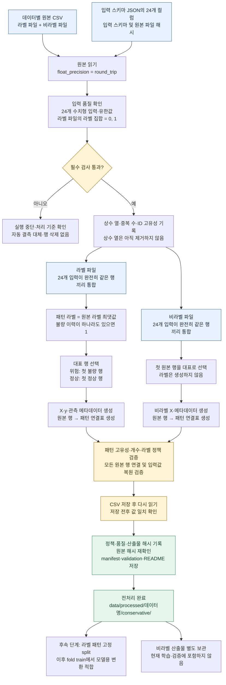
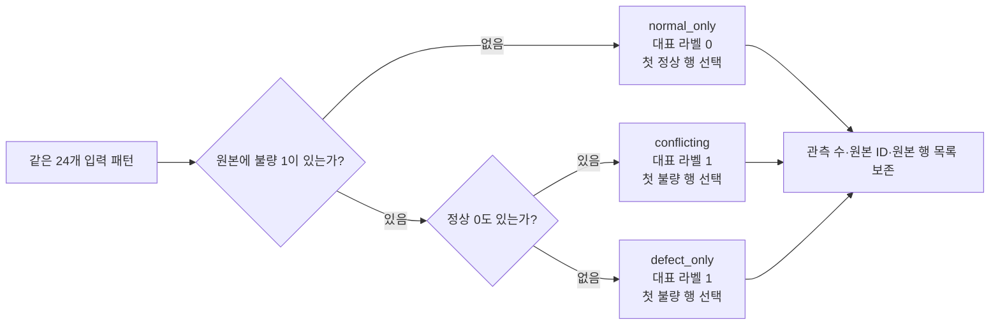
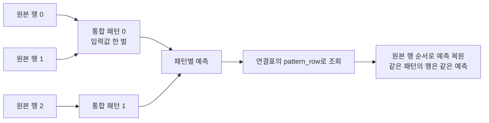
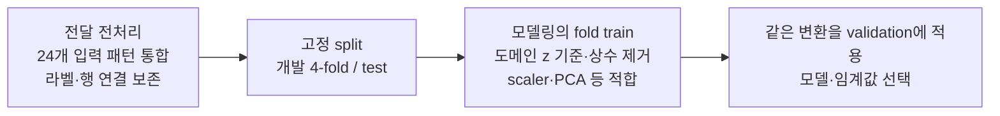

# CN7·RG3 데이터 전처리 로직 도식

갱신일: 2026-10-02. 입력 스키마는 `data/schema/input_features.json`에서 읽으며 `DATASET`으로 CN7/RG3를 선택한다. [CN7 전처리 코드](02_preprocess.ipynb)와 [RG3 전처리 코드](02_preprocess.ipynb)의 현재 구현을 기준으로 작성했다. 두 데이터에 동일한 정책을 독립 적용한다.

## 1. 전체 전처리 흐름

통합 키는 **24개 입력값 전체**다. 원본 ID나 라벨은 통합 키에 포함하지 않는다. 반올림·근삿값 묶기·평균값 대체를 하지 않으며, 대표 행의 입력값을 그대로 보존한다. 숫자 파싱 후 입력값이 정확히 같은 경우에만 같은 패턴으로 처리한다.

원본 ID의 고유성은 품질 항목으로 기록한다. 실제 모든 행 연결은 0부터 시작하는 `source_row`로 검증한다. 현재 코드는 CN7·RG3별 기대 행 수를 검사하므로 다른 버전의 원본을 넣으면 기준 개수 검증에서 중단될 수 있다.

## 2. 라벨 결정 상세

예를 들어 같은 입력의 라벨이 `[0, 0, 1]`이면 하나의 위험 패턴으로 통합한다. `normal_count=2`, `defect_count=1`, `total_count=3`, `representative_label=1`을 기록하고 세 원본 행을 같은 패턴으로 연결한다. 정상 관측 이력을 삭제한 것이 아니라 메타데이터에 보존한 것이다. 이 정책의 예측 목표는 개별 제품 불량 여부가 아닌 **불량 이력이 있는 입력 패턴**이다.

## 3. 산출물과 원본 연결

| 구분 | 산출물 | 내용 |
|---|---|---|
| 라벨 입력 | `X_labeled.csv`, `y_labeled.csv` | 고유 패턴 입력 24개와 같은 행 순서의 대표 라벨 |
| 라벨 메타데이터 | `labeled_metadata.csv` | 패턴 위치·ID·정상/불량 관측 수·관측 유형·대표 원본 행 |
| 라벨 연결표 | `source_row_mapping.csv` | 모든 원본 행의 위치·ID·원래 라벨과 대응 패턴 |
| 비라벨 입력 | `X_unlabeled.csv` | 고유 입력 패턴. 라벨 없음 |
| 비라벨 메타데이터 | `unlabeled_metadata.csv` | 패턴 위치·ID·관측 수·대표 원본 행 |
| 비라벨 연결표 | `unlabeled_source_row_mapping.csv` | 모든 비라벨 원본 행과 대응 패턴 |
| 검증 기록 | `preprocessing_manifest.json`, `validation.json`, `README.md` | 정책·품질·해시·검증 결과 |

위 도식의 행 번호는 예시다. 실제 `pattern_row`와 `source_row`는 각각 패턴 테이블과 원본 테이블의 0 기반 위치다. 패턴 ID는 데이터·파일별로 구분하고 최초 등장 순서로 부여한다. 라벨 파일과 비라벨 파일의 패턴 ID는 공통 좌표나 공통 패턴 식별자가 아니다. 두 파일의 표준화 좌표계 정합도 아직 확인되지 않았다.

## 4. 현재 자료의 처리 개수

| 데이터 | 라벨 원본 → 패턴 | 정상 / 위험 패턴 | 위험 패턴 구성 | 비라벨 원본 → 패턴 |
|---|---:|---:|---|---:|
| CN7 | 1,211 → 606 | 592 / 14 | 정상·불량 공존 11, 불량만 3 | 35,239 → 28,771 |
| RG3 | 1,182 → 591 | 566 / 25 | 정상·불량 공존 25, 불량만 0 | 35,941 → 29,707 |

CN7 원본 불량 17행과 RG3 원본 불량 25행의 이력은 메타데이터와 연결표에 보존한다. 연결표로 모든 원본 입력을 정확히 복원하고, 원본 불량 행이 반드시 위험 패턴에 연결됐는지 검사한다.

## 5. 파생변수 생성은 어느 단계인가?

**이 전처리 노트북에서는 도메인 파생변수를 만들지 않는다.** 입력 패턴 통합을 끝낸 후 split하고, 모델링 단계의 각 train에서 파생변수 기준을 적합한다.

| 단계 | 수행 범위 |
|---|---|
| 현재 전처리 | 품질 검사·완전 동일 패턴 통합·대표 라벨·원본 연결표·저장 검증 |
| 별도 split 코드 | 패턴 단위 test와 개발 4-fold 배정 |
| 모델링 | 정상 기준 도메인 파생변수, 모델별 상수 제거·스케일링·PCA·학습 |

정상 기준 도메인 z 통계는 해당 train 정상에서 구한다. 그 뒤 지도학습 모델은 변환된 정상·위험 train 전체로 학습한다. 세부 과정은 [모델링·학습·검증 매뉴얼](../03.modeling/common/CN7_RG3_CI_CT_CD_전체구조.md)을 따른다.
