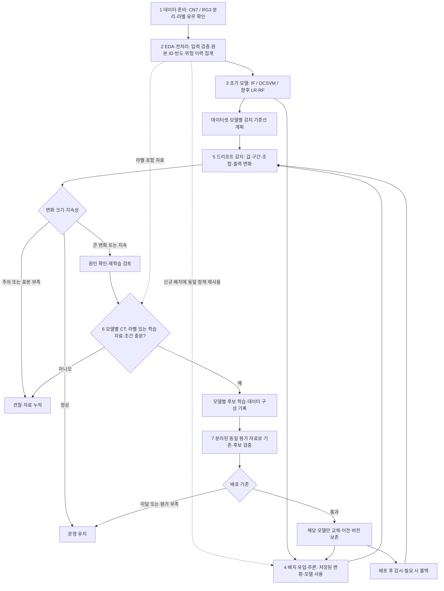

# CN7 · RG3 전체 파이프라인 — 전처리 통합 7단계

[개정 이미지](전체파이프라인_7단계.png) · [이전 8단계 시안](전체파이프라인_찐막.png)

별도 ‘검사·라벨 연결’ 단계를 제거합니다. 라벨이 포함된 신규 배치에는 기존 입력 검증·원본 연결·동일 패턴 위험 이력 집계 정책을 재사용합니다. 추가 검사 시스템이나 사후 라벨 접수 모듈을 가정하지 않습니다. 2026-10-03 로컬 Python API·CLI·운영 노트북을 구현했습니다. [실행 가이드](OPERATIONS_GUIDE.txt)를 참고하세요. 현장 검증·실제 운영 교체는 수행하지 않았습니다.

## 전체 흐름

## 단계별 현재 상태

| 단계 | 책임 | 현재 상태 |
|---|---|---|
| 1 데이터 준비 | 데이터셋·입력·ID·라벨 유무·스케일 확인 | 원본·스키마·기초 검증 있음. 현장 배치·정합 확인 추가 필요 |
| 2 EDA·전처리 | 원본·제품 빈도·패턴·max(label) 위험 이력 집계 | 기존 노트북 + 동일 정책의 배치 함수 구현 |
| 3 초기 모델·기준선 | IF·OCSVM·LR·RF, 감지 기준선 | IF/OCSVM 기존 구현, LR 전체 실험 완료, RF 고정 기준선, 빈도 보존 기준선 구현 |
| 4 배치 유입·추론 | 전처리 재사용·저장 모델 추론·결과 저장 | API/CLI 구현. 좌표 확인 전 보류, 비라벨 재학습 제외 |
| 5 드리프트 감지 | 윈도·분포·지속성·상태 | 로컬 구현·합성 테스트. 시험 경보선이며 현장 보정 필요 |
| 6 모델별 CT | 원인·라벨·자료량 조건 확인 후 후보 생성 | 4종 모델 전체 재학습 구현·격리 테스트. 점진 학습은 없음 |
| 7 검증·교체 | 평가·유지·승격·롤백 | 로컬 구현·격리 테스트. 실제 운영 미교체, 독립 평가 필요 |

기존 초기 모델 노트북에 `common/pipeline_runtime.py`, `pipeline_cli.py`, `04_operations.ipynb`, `models/logistic_regression.py`, `models/05_logistic_regression.ipynb`를 추가했습니다. 기존 `runtime`의 IF는 고정 버전이며 OCSVM·신규 LR는 후보입니다. 운영 OCSVM/LR은 이번 작업에서 지정하지 않았습니다. 코드 구현과 현장 배포 완료를 구분합니다.

## 전처리 재사용

- 라벨 포함 배치: 기존 검증·집계·원본 연결 정책 적용. 누적 학습 시 과거 위험 이력을 신규 정상 기록으로 덮어쓰지 않습니다.
- 비라벨 배치: 입력·원본·빈도·패턴을 보존하고 라벨을 생성하지 않습니다. 정합 확인 후 추론·감지에만 사용하며 현 설계의 재학습 대상에서는 제외합니다.
- 추론·감지는 제품 발생 빈도를 유지합니다. 학습용 고유 패턴과 제품별 결과는 원본 매핑으로 연결합니다.
- 추론에서는 저장된 스케일러·특징 변환을 사용하고 신규 배치로 다시 적합하지 않습니다.
- 기존 전처리 노트북은 고정 원본 경로를 처리합니다. 신규 `preprocess` 함수가 같은 정확 일치·최대 라벨 정책을 임의 배치에 적용하고, `Operations.ingest`가 이를 추론·기록·감지에 연결합니다.
- 학습/평가 분리는 분할·평가의 책임입니다. 기존 Test와 평가 전용 패턴을 후보 학습에 넣지 않습니다.

## 현재 데이터 기반 드리프트

RG3 충전시간 2종·사출시간 3종 등 반복 값은 값별 비율, 온도·압력은 기준에서 고정한 구간별 비율·범위 밖 비율, 작은 변수 조합은 조합별 비율을 비교합니다. 상수 위반·신규 값도 기록합니다. 비율 변화량은 `0.5 × Σ |현재 비율 - 기준 비율|`를 초기 지표로 제안합니다.

같은 IF·OCSVM 버전으로 기준·현재 점수 분포와 위험 예측 비율을 비교합니다. 제품 수·고유 패턴 수가 부족하면 판단 대기입니다. 경보선과 지속성 조건은 자연 변동·윈도 크기 실험으로 보정하며 아직 확정하지 않았습니다. 지속 입력 변화만으로도 검토하고 출력 변화 동반 시 근거를 강화합니다. 전체 신규 패턴 비율은 참고입니다.

라벨/비라벨 스케일 정합 전 비교는 보류하며 현재 원본 행 번호를 생산 시간으로 가정하지 않습니다. 경보는 자동 재배포 명령이 아닙니다.

## CT·평가 정책

IF·OCSVM은 정상 패턴, LR·RF는 정상·위험 라벨 자료를 학습합니다. 유입 배치·감지 윈도·재학습 크기는 각각 설정합니다. 원인 확인과 모델별 자료량 조건이 충족되면 후보를 만들고 기존/신규 비율·기간·고유 패턴 수를 기록합니다.

사전 고정한 분리 평가 자료로 기존·후보를 비교합니다. IF는 동일 검사 예산의 위험 발견 성능, 분류는 F1·Recall·오탐률을 평가합니다. 평가 부족·기준 미달은 유지·보류하고 통과 모델만 개별 교체합니다. 과거 버전을 보존하고 배포 후 감시·롤백을 구성합니다.

2026-10-03 LR 초기 학습과 Test 후속 평가를 실행했습니다. CT·승격·롤백은 격리된 합성 테스트에서 검증했으며 실제 runtime 운영 포인터는 유지했습니다. RG3 구간별 위험 이력 안내는 `distribution_guidance.txt`에 관측 수·Wilson 구간·표본 부족을 표시합니다. 학습 구간에서 구간을 정의하고 평가 수치로 모델/임계값을 재선택하지 않습니다.
