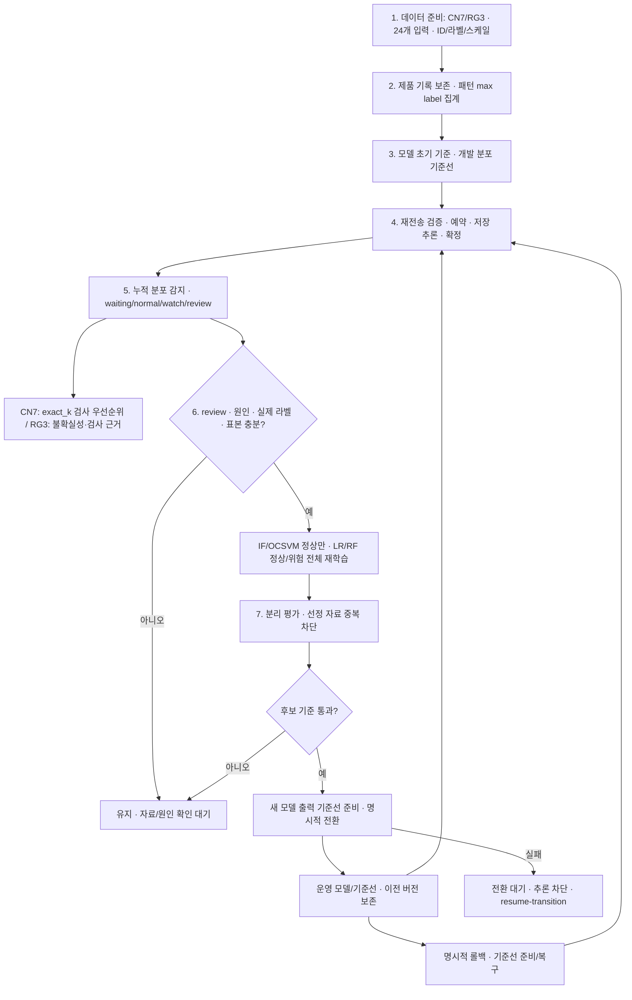

# KAMP 7단계 운영 연결과 인수 기준

2026-10-05 구현. 실제 운영 진입점은 `workflow_runtime.Operations`, `pipeline_cli.py`, `04_operations.ipynb`다.
`decision_runtime.py`는 재전송·검사 정책, `pipeline_runtime.py`는 학습/저장/감지의 하위 구현이며 직접 호출한 과거 테스트와 운영 계층의 검증을 구분한다.



| 단계 | 진입점 | 주요 입력/출력과 보류 |
|---|---|---|
| 1 준비 | `preprocess`, `validate_product_ids` | 좌표 확인·실제 라벨 출처. 부적합 입력 held/rejected |
| 2 전처리 | `ingest` | products 원본 ID/빈도, patterns 고유 입력/최대 라벨. 학습용 패턴과 제품 관측 구분 |
| 3 초기 기준 | `initial`, `initialize`, `baseline` | 고정 초기 기준과 실제 최적 모델 선정 구분. IF/OCSVM/LR/RF 각각 독립 |
| 4 추론 | `ingest`, `resume` | 저장 변환 재사용. 모델/입력/라벨/기록 ID 연결, 미완료 단계만 재개 |
| 5 감지·안내 | `drift`, `batch-status`, `refresh-advice` | 초기 안내 이력과 최신 감지 연결. completed는 요청 처리 완료이며 분포 판단 확정과 다름 |
| 6 CT | `retrain` | review + 원인 + 라벨 + 고유 패턴 조건. 비라벨/평가용 자료 제외, 전체 재학습 |
| 7 평가·전환 | `register-evaluation`, `evaluate`, `promote`, `rollback`, `resume-transition` | 같은 분리 자료 비교. 실제 자료 재등록/선정 패턴 중복 승격 차단. 실패는 유지/전환 대기 |

## 안내·버전·상태

- 최초 안내는 배치의 추론 모델, 감지 기준선, 감지 정책을 고정한다. 안내 실패 후 재개해도 현재 모델을 몰래 사용하지 않는다.
- `advice_history/<revision>`에 성공한 안내의 출력·근거를 보존하고 `advice_latest.json`으로 최신 출력을 조회한다.
- waiting 배치가 후속 윈도에 소비되면 `batch_drift_links.json`에 연결한다. 과거 안내를 지우지 않고 새 안내 revision을 만든다.
- 후속 안내 실패는 `latest_advice_error`와 pending 목록에 표시하고 `refresh-advice`로 재개한다. 자료 재수집/윈도 재소비 없음.
- `processing.json`의 최초 `advice_context`는 완료·실패 저장에서도 보존한다. 후속 안내는 별도 revision에 새 감지 근거를 기록하고 최초 context를 유지한다.
- `resume`은 완료 배치에도 수집 manifest의 제품·패턴·예측 파일 해시와 ID 계약을 확인한다. 자료 누락/손상 시 `rejected`를 반환하며 장부나 처리 단계를 변경하지 않는다.
- 새 안내 revision의 모델 점수는 배치 최초 추론 버전을 유지하며, 후속 분포 변화는 그 윈도의 기준선을 사용한다. 두 근거를 별도로 기록한다.
- CN7 RF는 현재 고정 초기 운영 기준이다. 별도 RF 탐색 결과가 자동 등록된 것이 아니다.
- exact_k는 제품 검사량을 고정한다. 평가 found_TP는 고유 위험 이력 패턴 단위이며 실제 제품 불량 발견률과 동일하지 않다.
- RG3 구간 이력·Wilson·드리프트는 기술 근거다. 제품 불량 확률·인과관계·안전 보증으로 표현하지 않는다.

## 공통 잠금과 전환

운영 API는 `.operation.lock`을 먼저, 내부 수집·writer 잠금을 다음으로 획득한다. 다른 프로세스/스레드의 수집·감지·전환을 동시에 허용하지 않는다.
잠금 해제는 작업 종료 확인 후 `unlock --lock operation --reason ...`으로 명시적으로 수행한다.

승격·롤백은 새 기준선을 먼저 준비한다. 입력 참조는 고정 개발 분포를 유지하고 모델 출력 구간만 새 모델로 계산한다.
`transition_pending.json`의 preparing/prepared/completed 상태로 기록하며 부분 전환 상태에서는 추론·CT·평가를 차단한다.
기준선 준비, 레지스트리/포인터 기록 실패는 `resume-transition`으로 같은 전환을 재개한다. 자동 현장 모델 교체는 하지 않는다.

## 평가와 라벨 정정

평가 CSV의 입력에서 fingerprint를 재계산하고 저장 열·manifest와 대조한다. 라벨은 완전한 0/1이어야 한다.
같은 내용의 재등록은 정규화 내용 해시와 이전 평가 ID를 연결한다. 선정에 사용한 자료와 겹치는 패턴은 새 ID나 부분 자료여도 최종 승격에 사용하지 못한다.
이미 관찰한 Test의 역할은 historical_followup이며 독립성이 새로 생기지 않는다.

라벨 정정 API는 구현하지 않았다. 재전송으로 기존 라벨을 변경하면 conflict다.
향후 정정에는 원천 제품/배치 ID, 검사 출처·시각, 정정 사유·승인자, 이전/새 라벨, 영향받는 패턴·학습/평가/모델 버전 이력과 재검증 절차가 필요하다.

### 2026-10-06 실행·복구 보완

- 경보 연속성은 바로 이전 확정 윈도의 기준선·정책과 비교한다. A→B→A 복귀는 새 연속 구간이다.
  `continuity_version=2`로 과거 횟수를 이어 쓰지 않으며, 소비 장부의 오래된 누락을 복구해도 최신 순서를 유지한다.
- 새 평가 등록은 `evaluation_staging/<ID>`에서 파일·manifest·integrity를 준비·검증한 뒤 폴더를 전환한다.
  실패 준비 폴더는 학습 보호·평가 목록에 포함되지 않는다. `evaluation-registration-status`로 조회하고 같은 입력·출처·purpose·ID로 재시도한다.
- 구형 평가의 CSV·입력 지문을 검증해 신규 자료 등록을 막지 않도록 했다. 구형 자료와 겹치는 패턴은 `historical_followup`으로 제한한다.
  `migrate-evaluation`은 원본을 보존하고 후속 평가 사본을 만든다. 과거 독립성이나 실행 당시 무결성을 소급 인증하지 않는다.
- `pyarrow==23.0.1`은 저장 RF 로드 의존성으로 선언했다. 새 인터프리터 프로세스에서 현재 활성 모델의 로드·추론을 검증했다.
- Python 소스는 LF 체크아웃을 선언한다. 과거 소스 감사는 바이트 일치 또는 LF/CRLF만의 변환을 구분해 기록한다.
  실제 코드 변경은 실패하며 모델·평가·LR 결과 산출물은 바이트 해시 그대로 검증한다. 과거 실행 기록은 수정하지 않는다.

구형 평가의 원천 파일이나 manifest까지 손상되었으면 이관을 거부한다. 독립 승격 평가에는 새 근거가 있는 분리 자료를 확보해야 한다.

```powershell
python 03.modeling/pipeline_cli.py --dataset rg3 --state-root tmp/rehearsal evaluation-registration-status
python 03.modeling/pipeline_cli.py --dataset rg3 --state-root tmp/rehearsal register-evaluation --input new.csv --label-source "검사 출처" --evaluation-id RECOVER
python 03.modeling/pipeline_cli.py --dataset rg3 --state-root tmp/rehearsal migrate-evaluation --evaluation-id OLD --new-evaluation-id COPY --label-source "원천 검사 출처" --reason "구형 평가 복구"
```

## 검증의 범위

운영 계층 테스트는 독립 state-root의 합성 fixture로 정상·실패·재개·보류·승격·롤백을 확인한다.
CN7/RG3의 종단 경로는 LR 후보로 실행하고, RF 안내 버전 고정도 별도로 검증한다. 4종 CT는 기존 통합 테스트의 근거이며 새 종단 리허설이 모든 모델 조합을 검사한 것은 아니다.
실제 생산 시간순·현장 스케일·원인·독립 라벨 및 현장 성능은 확인되지 않았다.
최소 표본 조건 충족과 기능 테스트 통과는 현장 최적 모델·예측 성능 입증이 아니다.

`run_checks_only.py`는 회귀 결과(`run_checks`)와 운영 준비 상태(`runtime_validation`)를 별도로 저장한다.
종료 코드는 두 항목 모두 통과하면 0, 회귀 실패 또는 기준선/상태 조회/복구 필요 상태가 있으면 1, 실행기 자체 오류는 2다.
오류 없는 `waiting`/`label_pending`은 정상 대기로 기록한다. 복구 단계·근거 손상·알 수 없는 pending 단계는 실패다.
완료된 배치의 감지 표본 대기는 pending 오류로 처리하지 않는다. 검사 실행기는 기준선을 생성하거나 운영 상태를 복구하지 않는다.

```powershell
python run_checks_only.py
python 03.modeling/pipeline_cli.py --dataset rg3 --state-root tmp/rehearsal batch-status --batch-id B
python 03.modeling/pipeline_cli.py --dataset rg3 --state-root tmp/rehearsal refresh-advice --batch-id B
python 03.modeling/pipeline_cli.py --dataset rg3 --state-root tmp/rehearsal resume-transition
```
