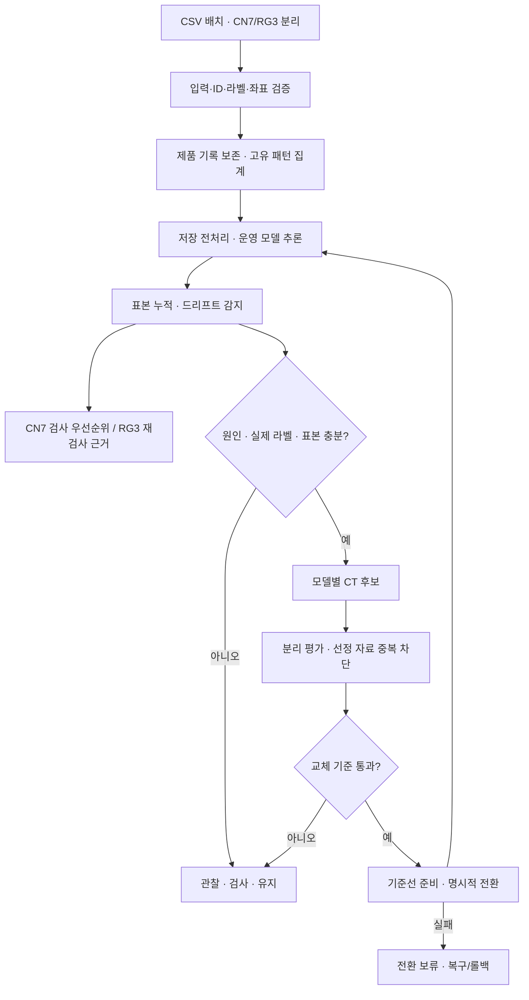

# KAMP 프로젝트 날짜별·기능별 작업 회고

작성 기준일: **2026-10-05**  
대상: `D:\workspace\kamp`, `develop_seo` 프로젝트  
근거: Git 기록, 저장된 실험 결과, Claude·Codex 작업 보고서, 실제 Python 테스트 결과

> 이 문서는 확인된 작업을 정리한 회고 초안이다. 개인적인 감정이나 기록에 없는 작업 시각은 만들지 않았다. 날짜가 확인되지 않는 초기 대화는 별도의 날짜를 부여하지 않고 방향성 변화에 포함했다. 팀원·Claude·Codex의 작업이 함께 포함된 프로젝트 전체 기록이며, 개인이 모두 직접 구현했다는 의미는 아니다.

## 1. 프로젝트 전체를 돌아보며

초기에는 공정 입력값으로 정상과 불량을 구분하는 모델을 만드는 데 집중했다. 변수 간 관계, 다차원 방향, 정상 관계식의 잔차, 앞뒤 관측의 문맥, 여러 모델의 결합을 시도하면 작은 신호를 발견할 수 있을 것이라고 생각했다.

분석 과정에서 같은 24개 입력값에 정상과 불량 라벨이 함께 존재한다는 구조적 문제가 확인됐다. 특히 RG3는 위험 이력이 있는 모든 패턴에 정상 기록도 있었다. 모델 종류를 바꾸거나 여러 모델을 덧붙이는 것만으로 이 문제를 해결했다는 근거는 확보하지 못했다.

이후 프로젝트의 중심을 **“어떤 모델이 더 높은 점수를 얻는가”에서 “현재 데이터로 어떤 판단을 할 수 있고, 어떤 상황에서 검사를 요청하며, 언제 재학습과 모델 교체를 허용할 것인가”로 확장**했다.

현재 구조는 공통 수집·전처리·모델 관리 기반 위에 데이터별 판단 정책을 적용한다. CN7은 검사 예산 내 우선순위를 만들고, RG3는 분포 변화와 정보 부족에 근거한 재검사 안내를 제공한다. 재학습과 교체에는 실제 라벨, 원인 기록, 충분한 표본, 분리된 평가 근거가 필요하다.

### 현재 완료 수준

| 구분 | 상태 |
|---|---|
| 로컬 CSV/API/CLI 기반 운영 파이프라인 | 구현 완료 |
| 장애 복구·재전송·평가·전환 기능 검증 | 최신 회귀 122개 + 저장 LR 감사 통과 |
| 실제 운영 runtime 및 기존 LR 결과 보존 | 마지막 수정 전후 120개 파일 해시 동일 |
| CN7 RF 운영 기준 및 기준선 | 지정·생성 기록 있음. 최적 모델 입증과는 별개 |
| RG3 운영 기준선 | 현재 포인터 없음. 운영 시작 전 준비 또는 복구 필요 |
| 실제 생산 데이터 기반 현장 성능 | 미검증 |
| 실제 DB·웹 서비스·상시 운영 스케줄러 | 이번 구현 범위에 포함되지 않음 |
| 별도 라벨 정정 API | 요구사항 문서화, 미구현 |

## 2. 날짜별 작업 기록

### 2026-09-29 — 전처리·분할·모델링 흐름의 기반 정리

**확인 근거:** Git `a704a4a`(데이터 분할·모델링·학습 및 검증 파이프라인), `4a76f19`(전처리·모델링 다이어그램).

- 팀 작업으로 데이터 분할과 모델 학습·검증 흐름을 정리했다.
- 전처리와 모델링 로직을 다이어그램으로 표현해 단계 간 연결을 공유했다.
- 이후 논의의 공통 기준이 되는 입력·라벨·분할·검증 구조를 마련했다.

**회고 포인트:** 모델링을 시작하기 전에 각 단계의 입력과 출력, 학습 자료와 검증 자료의 역할을 공유해야 이후 설계 변경을 일관되게 적용할 수 있었다. 이 날짜의 세부 구현은 커밋 제목으로 확인되는 범위만 기록했다.

### 2026-10-01 — 변수 관계·모델 결합·라벨 충돌 가설 실험

**목표:** 개별 변수에서 잘 드러나지 않는 불량 신호가 변수 간 관계나 모델 간 보완성에 존재하는지 확인했다.

#### 정상 관계식과 잔차

- 정상 참조 패턴으로 한 변수를 나머지 변수에서 예측하는 Ridge·ExtraTrees 관계식을 학습했다.
- 정상 내부 OOF 관계 예측 품질을 확인하고, 정상 오차 기준으로 잔차를 정규화했다.
- 잔차만 사용하는 분류와 원본 입력에 잔차를 추가하는 분류를 LR·RF로 비교했다.
- 패턴 고정 분할과 시간순 가정 실험을 구분했다.
- CN7 선택 잔차 모델의 후속 Test F1은 0, RG3 선택 잔차 모델은 약 0.054였다.
- 시간순 가정 CN7은 미래 검증 구간에 불량이 없어 탐지 성능 평가를 보류했다. RG3의 선택된 시간 문맥 모델도 후속 Test F1이 0이었다.

**배운 점:** 변수 관계가 잘 예측된다는 사실과 불량을 잘 구분한다는 사실은 다르다. 높은 관계 예측 R²를 불량 분류 성능이나 물리적 인과관계로 해석하면 안 된다. 원본 행 순서가 실제 생산 시간순이라는 가정도 확인이 필요했다.

#### 두 단계 모델 결합

- RF, 관계식 기반 점수, IF 점수를 OOF 방식으로 생성하고 단순 결합과 LR 스태킹을 비교했다.
- 외부 4-fold·내부 3-fold 구조를 사용해 결합 학습의 누수를 줄였다.
- 검사 예산 상위 10%를 주요 관찰 지표로 사용했다.
- CN7 스태킹은 개발 OOF에서 위험 11개를 상위 예산 안에 포함했고, 후속 Test에서도 위험 3개가 상위 예산에 포함됐다. 해당 실험의 RF도 Test 상위 예산에 3개를 포함했다.
- RG3 스태킹은 개발 OOF에서 일부 개선이 있었지만 후속 Test 상위 예산에서 위험 5개 중 0개를 포함했다.

**배운 점:** 모델을 한 번 더 학습하는 구조 자체가 일반화 개선을 보장하지 않는다. 이미 관찰한 Test와 소수 위험 사례로 얻은 결과를 최종 독립 성능으로 주장할 수 없었다.

#### RG3 충돌 라벨 가정 비교

- 충돌 패턴을 모두 정상으로 보는 경우와 모두 위험으로 보는 경우를 비교했다.
- 모두 정상으로 처리하면 591개 패턴에 위험 정답이 0개가 남아 탐지 학습·검증이 불가능했다.
- 모두 위험으로 처리하면 기존 `max(label)` 위험 이력 정책과 같았다.
- 원본 라벨은 변경하지 않았고, 같은 조건의 재학습을 불필요하게 반복하지 않았다.

**배운 점:** 라벨 가정을 바꾼 뒤 그 가정에 맞는 점수를 얻는 것만으로 원본 라벨의 진위를 판정할 수 없다. 외부 요인 가능성은 가설이며, 어떤 변수가 빠졌는지는 현재 데이터만으로 확정하지 못했다.

### 2026-10-02 — 전체 학습 구조와 IF 검사 우선순위 연결

**확인 근거:** Git `55c8dbe`, `5b0571f`(팀원 전체 파이프라인·IF 구성), `2a836c5`(팀원 RF 모델링 결과), `1c45401`(main 변경 병합).

- 팀 작업으로 전체 학습 파이프라인을 정리하고 모델링 전 IF 이상탐지·검사 우선순위를 연결했다.
- RF 모델링 결과를 프로젝트에 반영했다.
- 팀 변경을 병합해 이후 공통 운영 구조를 구성할 기반으로 사용했다.

**회고 포인트:** 이상 점수는 검사 순위를 만드는 근거가 될 수 있지만 불량 정답을 대신하지 않는다. 이후 설계에서는 IF→OCSVM의 필수 직렬 연결보다 모델별 독립 후보와 명시적 비교를 중심에 두었다. 이 날짜의 세부 성능 수치는 커밋 제목만으로 추가하지 않았다.

### 2026-10-03 — 7단계 운영 구현과 로지스틱 모델 테스트

**요청:** 아키텍처의 미구현 부분 구축, 검토 사항 보완, 담당 LR 테스트, RG3 분포 기반 안내, 작업 기록 및 인계 프롬프트 작성.

#### 공통 운영 경로 구축

- 배치 입력 검증·전처리·저장 모델 추론·기준선·드리프트·조건부 CT·분리 평가·승격·롤백을 로컬 API/CLI로 연결했다.
- 제품 ID와 원본 발생 빈도를 보존하고, 학습용 고유 패턴과 운영 감시용 제품 분포를 구분했다.
- 비라벨 자료는 정합 확인 후 추론·감시에 사용하고 CT 정답으로 사용하지 않았다.
- 후보 등록에서 감사 모델·선택 기록·입력·분할·코드 연결을 확인하고, 고유 실행 폴더로 결과 덮어쓰기를 방지했다.

#### 담당 LR 실험 수행

- 데이터셋별 8개 구성 × 15개 C × 2개 클래스 가중치 = 240개 설정을 개발 4-fold에서 비교했다.
- 각 설정의 1,001개 임계값을 비교해 데이터셋당 240,240행의 설정·임계값 결과를 생성했다.
- 선택된 설정으로 개발 자료를 재학습한 뒤 보관 Test를 후속 평가했다.

| 데이터 | 선택 구성 | C | 가중치 | 임계값 | OOF F1 | 후속 Test F1 | TP / FP / FN / TN |
|---|---|---:|---|---:|---:|---:|---|
| CN7 | thermal | 10 | none | 0.921 | 0.625 | 0 | 0 / 0 / 3 / 119 |
| RG3 | thermal | 약 0.3162 | none | 0.012 | 약 0.0893 | 약 0.0833 | 5 / 110 / 0 / 4 |

**해석:** CN7은 개발 검증 점수가 높아도 Test 위험을 모두 놓쳤다. RG3는 위험을 찾았지만 정상 114개 중 110개를 오탐했다. Test를 보고 임계값을 재조정하지 않았으며, 이 결과를 실사용 성능 확보로 표현하지 않았다.

#### 데이터별 판단 정책으로 전환

- CN7은 LR·RF·OCSVM의 최소 사용 기준과 검사 예산 비교를 구성했다. 이후 기본 정책을 RF 기반 검사 우선순위로 정리했다.
- RG3는 위험 이력 구간과 표본 부족을 출력하는 기능에서 시작했으나, 최초 안내가 전체 Test 119개를 재검사 대상으로 표시하는 문제를 확인했다.
- 같은 날 후속 보완에서 위험 이력은 기본 참고 표시로 두고, 범위 밖·정보 부족·드리프트에 근거한 불확실성 안내로 정리했다.
- 당시 일부 클라우드 검사에서는 확률의 극히 작은 수치 차이 때문에 엄격한 비교가 실패했다. 결과를 숨기지 않고 예측 판정 일치와 허용 오차를 구분해 검증했다.

**회고 포인트:** 높은 탐지율만 추구하면 대부분의 정상을 경보로 만들 수 있다. 실제로 어떤 검사를 요청할지, 검사량을 줄일 근거가 있는지를 판단 정책에 포함해야 했다.

### 2026-10-05 — 팀장 검토 대응과 운영 신뢰성 보완

#### 1차 검토: 수집·판단의 기본 계약 보완

- 행 순서가 달라도 동일 재전송을 인식하도록 내용 지문을 정규화했다.
- 처리 단계를 기록해 감지나 안내가 실패해도 수집된 배치를 다시 저장하지 않도록 했다.
- 수집 경쟁을 막는 잠금과 저장 전 예약을 도입했다.
- 표본 부족을 정상 또는 낮은 불확실성으로 표시하지 않고 판단 대기로 구분했다.
- CN7 실제 검사와 평가의 동점 선택 규칙을 맞췄다.
- 정책이 바뀌면 드리프트 경보선 캐시를 재사용하지 않도록 했다.
- 평가 자료 용도 변경을 감지하도록 무결성 기록을 보강했다.
- 별도 실행 기록에서 CN7 RF를 운영 비교 기준으로 지정하고 기준선을 생성했다. 이 작업은 최적 모델 확정과 구분한다.

#### 2차 검토 P0: 중복·누락·근거 우회 차단

- R01: 감지 결과는 저장됐지만 소비 장부가 기록되지 않은 경우를 drift ID 기준으로 복구해 재소비를 방지했다.
- R02: 같은 배치에서 제품 ID만 교체하거나 입력·라벨 연결을 바꾸는 재전송을 차단했다.
- R03: 선정·평가 통과·승격에 `exact_k`를 요구하고 `all_ties`는 참고로 제한했다.
- A 계약 ID의 결측·빈 값·공백·실수형을 예약 전에 검증했다.
- 기존 완료 배치도 저장 제품 파일에서 연결 근거를 재검증하도록 했다.
- manifest·색인·처리 상태가 유실된 경우 자료를 새 배치처럼 재수집하지 않고 검증 불가로 거부했다.
- 재전송 조합 표를 확장해 기존 판단 테스트에 226개 하위 조합을 포함했다.
- 과거 LR 실행 기록을 수정하는 대신 출처 보관본과 선택 설정 재학습 재현으로 감사를 보강했다.

#### P1·P2: 운영 계층과 교체 복구 구축

- `workflow_runtime.py`를 운영 진입점으로 추가했다.
- 안내 재개 시 최초 모델·기준선·정책을 유지하고 성공 안내별 revision을 보존했다.
- waiting 배치를 후속 감지 윈도와 연결하고 후속 안내 실패를 복구할 수 있게 했다.
- 수집·감지·CT·전환을 공통 operation 잠금으로 묶었다.
- 승격·롤백의 기준선 준비와 포인터 저장 실패를 전환 저널로 추적하고 재개하도록 했다.
- 평가 입력 지문 재계산, 동일 자료 재등록 이력, 선정 자료와의 패턴 중복 차단을 추가했다.
- 7단계 문서·진입점·복구 명령을 정리하고 CN7/RG3의 격리 종단 흐름을 실행했다.
- 이 시점 전체 115개 검사와 LR 감사가 통과했다.

#### 추가 재검토: 테스트 통과 후 남아 있던 3건 수정

| 발견한 문제 | 수정 내용 | 확인 결과 |
|---|---|---|
| 기준선이 잘못돼도 검사 실행기가 성공 코드 반환 | 회귀 결과와 운영 준비 상태를 분리하고 최종 코드에 둘 다 반영 | 실제 RG3 기준선 부재가 코드 1로 표시됨 |
| 완료 배치 `resume`이 파일 손상을 확인하지 않음 | 완료·미완료 재개 전에 수집 파일 해시·ID 계약 검증 | A/C 20개 파일 상태 조합에서 정상 완료/거부 확인 |
| 완료 저장에서 `advice_context`가 사라짐 | 최신 처리 기록을 병합하고 attempts 보존 | 완료·실패·모델 교체 후 재개·후속 안내에서 출처 유지 |

- 추가 회귀 7개를 포함해 **최종 122개 검사와 저장 LR 감사가 통과**했다.
- 실제 운영 runtime과 기존 LR 파일 120개의 전후 해시가 같았다.
- `run_checks_only`는 현재 RG3 기준선 포인터 부재 때문에 최종 코드 1을 반환한다. 회귀 실패와 운영 준비 미완료를 구분해 보고한다.

**회고 포인트:** 정상 실행 테스트가 모두 통과해도 파일 누락, 중간 저장 실패, 과거 기록, 재시도, 모델 전환이 결합하면 새로운 문제가 생길 수 있었다. 개별 증상을 고치는 방식에서 벗어나 실패 지점과 상태를 조합해 검사하는 방식이 필요했다.

## 3. 기능별 구현 회고

### 기능 1. 데이터 해석과 패턴 단위 전처리

**주요 날짜:** 초기 기반 작업, 10-01 가설 검토, 10-03 운영 연결, 10-05 계약 보완.

| 데이터 | 원본 라벨 행 | 고유 입력 패턴 | 정상 이력만 | 위험 이력 | 정상·불량 충돌 |
|---|---:|---:|---:|---:|---:|
| CN7 | 1,211 | 606 | 592 | 14 | 11 |
| RG3 | 1,182 | 591 | 566 | 25 | 25 |

**문제:** 같은 입력이 반복되고 그 안에 라벨 충돌이 있어, 행을 그대로 무작위 분할하면 동일 입력이 학습과 평가에 걸칠 수 있었다.

**구현:** 24개 입력이 정확히 같은 행을 패턴으로 묶고 대표 라벨을 `max(label)`로 정했다. 원본 행·라벨·제품 빈도·ID 연결은 별도 보존했다.

**회고:** 패턴의 위험 라벨은 불량 이력이 있었다는 뜻이다. 현재 제품이 불량일 확률과 같지 않다. 학습에서 중복을 줄이는 것과 운영 분포에서 빈도를 보존하는 것은 함께 필요했다.

### 기능 2. 고정 분할·OOF·학습 누수 방지

**주요 날짜:** 09-29 기반, 10-01 결합 실험, 10-03 모델 실험, 10-05 평가 보호 강화.

- seed 42 고정 계층 분할: CN7 개발 484/Test 122, RG3 개발 472/Test 119.
- 개발 4-fold에서 각 패턴의 검증 예측을 만들고, 변환은 학습 fold에서 적합했다.
- Test는 설정 선택에 사용하지 않고 후속 관찰로 다뤘다.
- CT 학습 자료와 평가 자료의 패턴 중복을 차단했다.
- 이미 관찰한 Test에는 `historical_followup` 역할을 적용했다.

**회고:** 같은 평가 자료를 반복해서 참고하면 파일 이름이 Test여도 독립성이 회복되지 않는다. 자료의 역할과 사용 이력이 모델 점수만큼 중요했다.

### 기능 3. 관계식·잔차·시간 문맥·스태킹 실험

**주요 날짜:** 10-01.

**구현:** 정상 관계식의 OOF 오차를 기준으로 잔차를 만들고, 원본 입력·잔차·모델 점수의 결합을 비교했다. 시간 문맥은 가정 실험으로 별도 구분했다.

**결과:** 변수 관계를 모델링할 수 있었으나 안정적인 불량 구분 개선을 입증하지 못했다. RG3 결합 모델의 개발 개선도 후속 Test에서 유지되지 않았다.

**회고:** 실험 실패도 방향을 정하는 근거가 됐다. 현재 운영에는 실험을 무조건 추가하기보다 데이터의 한계를 드러내는 판단·검사 구조를 채택했다. 이 실험들은 현재 필수 운영 단계가 아니다.

### 기능 4. 모델별 학습과 LR 담당 테스트

**주요 날짜:** 10-02 모델 연결, 10-03 LR 실험, 10-05 감사 보강.

- IF·OCSVM: 정상 패턴을 기준으로 이상 점수 생성.
- LR·RF: 정상·위험 이력 패턴을 사용해 지도학습.
- LR 탐색: 240개 설정과 1,001개 임계값을 개발 OOF 기준으로 비교.
- 선택 결과·모델·fold 역할·OOF·후속 Test 예측을 저장했다.
- 감사에서 선택 결과 계산과 현재 코드의 선택 설정 재학습을 재현했다.

**회고:** LR은 계수와 규제 설정을 해석하기 좋은 비교 모델이지만, 이번 데이터에서는 실사용 성능을 확보했다고 볼 수 없었다. Test 실패를 숨기지 않고 다음 의사결정의 근거로 사용했다.

### 기능 5. CN7 검사 예산 우선순위

**주요 날짜:** 10-03 정책 구현, 10-05 동점·비교·운영 기준 보완.

**구현:** RF 점수로 제품을 정렬하고 사전 검사 비율만큼 검사 대상을 표시한다. 기본 `exact_k` 규칙은 경계 동점에서도 정해진 검사 수를 유지하며 입력 지문·제품 ID로 순서를 고정한다.

**보완:** 실제 검사와 평가의 선택 규칙을 맞추고, `all_ties` 결과를 선정·승격 근거로 사용하지 못하도록 했다. 발견 비율의 분모에는 실제 검사 수를 반영했다.

**회고:** 검사 대상의 순위 품질과 고정 임계값의 분류 성능은 다르다. 제품 단위 예산과 고유 패턴 단위 평가도 같은 의미가 아니다. RF 운영 지정은 비교 기준 마련이며 최적 모델 확정이 아니다.

### 기능 6. RG3 불확실성·재검사·구간 안내

**주요 날짜:** 10-03 정책 구현·수정, 10-05 판단 대기와 후속 안내 보완.

**구현:** 학습 범위 밖 값, 표본 부족, 분포 변화와 구간별 관측 위험 이력을 연결해 제품별 안내를 생성한다. 위험 이력은 기본 참고 표시로 유지한다. 구간 표본과 참고 Wilson 구간을 함께 표시한다.

**상태:** 판단 대기 / 관찰 / 주의 / 추가 검사·원인 검토를 구분한다. 표본이 부족하거나 위험 관측이 0개인 것을 정상 보증으로 바꾸지 않는다.

**회고:** “불량 위험도”라는 표현은 현재 근거보다 강했다. 사용자가 실제로 확인해야 할 정보와 판단 근거의 부족 정도를 전달하는 방식이 더 타당했다. 현장 검사 효율과 탐지 유효성은 아직 검증하지 못했다.

### 기능 7. 배치 수집·A/C 제품 ID 계약·중복 보호

**주요 날짜:** 10-03 수집 기반, 10-05 집중 보완.

- A 계약: 원천 `record_id`/`product_id`를 데이터셋 내 고유 생산 ID로 취급한다.
- C 계약: ID가 없으면 내부 행 ID를 만들되 다른 배치의 생산 ID처럼 비교하지 않는다.
- `Unnamed: 0`은 파일 행 번호로 취급한다.
- 내용 지문은 행 순서에 무관하게 만들고, A 계약은 ID→입력→라벨 연결 해시를 비교한다.
- 새 생산 ID가 모두 다른 동일 조건 생산과, 같은 생산 제품의 재전송을 구분한다.
- 저장 전 예약으로 수집 중단 구간에서도 ID와 내용의 중복을 막는다.

**회고:** 입력값이 같다고 같은 제품은 아니며, 배치 ID가 다르다고 새 생산도 아니다. 원천 제품 ID가 없는 자료에는 내용 기반 중복 의심이라는 한계가 남는다. 근거가 사라지면 C 계약으로 추정해 통과시키지 않는다.

### 기능 8. 드리프트·소비 장부·감지 정책

**주요 날짜:** 10-03 구현, 10-05 R01·캐시·후속 연결 보완.

**구현:** 개발 제품 빈도 참조를 기준으로 값별/고정 구간별 비율, 변수 조합, 같은 버전 모델의 점수 분포를 비교한다. 표본을 누적해 감지 윈도를 구성하고 TV 거리·경험적 부트스트랩 경보선을 사용한다.

**보완:** 완성된 윈도는 한 번만 소비한다. 결과 저장과 소비 장부 저장 사이의 실패는 drift ID로 복구한다. 연속 경보는 같은 기준선과 정책에서만 누적하며 정책 변경 시 경보선 캐시를 구분한다.

**회고:** 분포 변화는 불량 증가나 원인을 확정하지 않는다. 또한 도착 배치 순서를 관리하는 기능과 실제 생산 시계열을 검증하는 일은 다르다. 현장 시간 의존성과 표본 크기에 맞춘 경보 보정이 후속 과제다.

### 기능 9. 처리 상태·재개·저장 자료 검증

**주요 날짜:** 10-05.

**구현:** 예약, 저장·확정, 감지, 안내, 완료 단계를 기록하고 실패한 단계부터 재개한다. 같은 배치를 재개해도 원본 수집이나 감지 윈도를 중복 실행하지 않는다.

**보완:** 완료 기록만 믿지 않고 manifest와 저장 제품 파일을 확인한다. 최신 수정에서는 `resume`도 제품·패턴·예측 파일을 검증하고 근거 부족이면 `rejected`로 반환한다.

**회고:** 완료 플래그와 데이터의 정상 보존은 별개였다. 정상 재전송 외에도 파일 없음, 폴더로 바뀜, 읽기 실패, manifest 손상, 색인 유실, 라벨 상태를 조합한 테스트가 필요했다.

### 기능 10. 안내 버전 고정·후속 연결·출처 이력

**주요 날짜:** 10-05 P1 및 최종 3건 보완.

- 최초 안내의 모델 버전·기준선·정책을 `advice_context`로 고정한다.
- 성공한 안내는 `advice_history/<revision>`에 보존한다.
- waiting 배치가 후속 윈도에 포함되면 `batch_drift_links`와 새 revision으로 연결한다.
- 후속 안내 실패는 오류로 표시하고 `refresh-advice`로 재개한다.
- 완료/실패 저장에서 최초 context가 지워지던 문제를 최신 처리 기록 병합으로 해결했다.

**회고:** 재시도가 현재 최신 모델을 임의로 쓰면 최초 결과의 출처가 바뀐다. 최초 추론 근거와 후속 감지 근거를 함께 추적할 수 있어야 결과를 설명할 수 있었다.

### 기능 11. 조건부 지속학습 CT

**주요 날짜:** 10-03 구현, 10-05 운영 연결 검증.

**구현:** 변화 검토, 원인 기록, 실제 라벨, 정상·위험 고유 표본 조건을 만족하면 모델별 독립 후보를 생성한다. IF·OCSVM은 정상 패턴, LR·RF는 정상·위험 패턴으로 전체 재학습한다.

**보호:** 비라벨·예측 라벨·평가용 패턴을 학습에 사용하지 않고 기존 위험 이력을 새 정상 라벨로 자동 제거하지 않는다. 후보 생성과 운영 교체를 분리한다.

**회고:** 초기 pseudo-label 반복 학습 구상은 현재 기본 운영에서 채택하지 않았다. 확인되지 않은 예측을 정답으로 되먹이는 위험을 줄이고 실제 검사 근거에 기반한 재학습을 택했다. 현재 CT는 전체 재학습이며 LR `partial_fit` 운영 구현은 아니다.

### 기능 12. 평가·승격·롤백·전환 복구

**주요 날짜:** 10-03 기본 구현, 10-05 P1·P2 강화.

- 같은 분리 평가 자료로 기존 모델과 후보를 비교한다.
- 표본 부족, 기준 미달, 이미 관찰한 평가, 학습 중복이면 보류한다.
- 선정에 사용한 자료와 패턴이 겹치면 새 ID로 재등록하거나 일부만 사용해도 승격을 막는다.
- 새 기준선을 준비한 뒤 명시적 교체를 수행한다.
- 전환 중 실패는 `transition_pending`에 남기고 운영 작업을 차단한다. `resume-transition`으로 같은 전환을 재개한다.
- 롤백도 기준선과 함께 추적한다.

**회고:** 모델 파일 교체가 성공해도 기준선 포인터가 이전 버전을 가리키면 운영 의미가 깨진다. 교체 자체의 성공보다 모델·기준선 연결과 실패 후 복구가 중요했다. 파일 저널을 사용한 복구 구조이며 DB 트랜잭션과 동일한 보장은 아니다.

### 기능 13. 공통 잠금·검사 실행기·감사

**주요 날짜:** 10-03 초기 검증, 10-05 강화.

- operation→ingest/writer 순서로 잠금을 획득해 수집·감지·교체의 경쟁을 제한한다.
- 실제 두 프로세스와 같은 객체의 두 스레드 경쟁 차단을 검사했다.
- 검사 실행기는 회귀 통과와 운영 준비 상태를 별도로 기록한다.
- 오래된 LR 기록은 변경하지 않고 당시 runtime 보관본을 확인한다.
- 당시 노트북 학습 정의 해시가 기록되지 않았다는 한계를 밝히고 선택 설정 재학습 재현으로 보완했다.
- 임시 state-root에서 테스트하고 실제 운영·LR 결과의 전후 해시를 비교했다.

**회고:** 테스트 환경의 수치 오차, 검사 실행기의 종료 코드, 운영 기준선 상태를 따로 판단해야 했다. “검사 통과”라는 한 문장으로 현장 성능·운영 준비·출처 완전성을 모두 보장할 수 없었다.

## 4. 전체 구조와 구현 파일

| 파일/경로 | 역할 |
|---|---|
| `03.modeling/common/pipeline_runtime.py` | 학습·모델 저장·기준선·감지·CT/CD 공통 기반 |
| `03.modeling/common/decision_runtime.py` | A/C 계약·중복·처리 상태·재개·데이터별 판단 정책 |
| `03.modeling/common/workflow_runtime.py` | 현재 운영 진입점·공통 잠금·버전 고정·후속 연결·전환 복구·평가 이력 |
| `03.modeling/pipeline_cli.py` | 명시적 로컬 운영 명령 |
| `03.modeling/04_operations.ipynb` | 운영 상태·결과 조회와 명시적 작업 연결 |
| `03.modeling/models/logistic_regression.py` | LR 실험·선택·저장 |
| `03.modeling/tests/` | 회귀·복구·등록·학습 감사 테스트 |
| `run_checks_only.py` | 회귀 및 운영 준비 상태 검사·종료 코드 |
| `runtime/<dataset>/` | 모델·배치·기준선·감지·평가·전환 이력 |
| `output/logistic/` | 기존 LR 실행 결과와 근거 |

## 5. 회고록에 활용할 핵심 배움

1. **문제의 정의가 모델 선택보다 먼저였다.** 동일 입력의 라벨 충돌을 확인한 뒤, 개별 제품 불량 확정과 위험 이력 패턴 탐지를 구분했다.
2. **좋은 개발 점수만으로 운영 결정을 할 수 없었다.** CN7 LR의 OOF와 후속 Test 차이는 평가 독립성과 희소 위험 표본의 중요성을 보여줬다.
3. **실패한 실험도 설계 방향을 바꿨다.** 관계식과 스태킹 실험은 현재 입력의 한계를 확인하고 검사·관찰 중심 정책을 선택하는 근거가 됐다.
4. **자동 학습보다 학습 조건을 설계하는 일이 중요했다.** 분포 변화만으로 정상 기준을 바꾸지 않고 원인과 실제 라벨을 요구했다.
5. **운영 신뢰성은 실패 경로에서 드러났다.** 재전송, 예약, 장부 저장, 처리 상태, 파일 손상, 모델 전환을 조합해 확인했다.
6. **출처를 보존해야 결과를 설명할 수 있었다.** 모델·입력·라벨·기준선·정책·실행 ID가 연결돼야 동일 결과를 재현할 수 있었다.
7. **모르는 것을 결과에 표현해야 했다.** RG3의 정보 부족·미관측 구간·판단 대기를 정상 또는 낮은 불량 위험으로 포장하지 않았다.
8. **교차 검토의 역할을 나눌 필요가 있었다.** 팀장 지적을 코드와 대조하고 Claude·Codex 검토를 반복했으며, 후반에는 개별 사례 수정에서 상태 조합 검증으로 확장했다.

### 서술형 회고 초안

> 이번 프로젝트에서 가장 큰 변화는 모델 성능을 높이는 문제를 운영 판단의 문제로 확장한 것이다. 초반에는 변수 사이의 관계나 여러 모델의 결합으로 숨은 불량 신호를 찾으려고 했다. 그러나 같은 입력에 정상과 불량이 함께 존재하는 데이터 구조와 실험의 일반화 한계를 확인하면서, 모델 점수를 확정 판정처럼 사용하는 것이 적절하지 않다는 점을 배웠다.
>
> 이후 CN7은 제한된 검사 예산 안에서 우선순위를 정하고, RG3는 판단 근거가 부족한 조건과 분포 변화를 알려 재검사를 요청하는 방향으로 구성했다. 또한 실제 라벨과 원인이 확인된 경우에만 재학습 후보를 만들고 분리된 평가를 거쳐 교체하도록 했다. 수집·감지·안내·교체가 중간에 실패했을 때의 복구까지 검증하면서, 설명 가능한 시스템은 모델의 설명만으로 완성되지 않고 데이터와 판단 이력의 연결까지 필요하다는 점을 배웠다.
>
> 현재는 파이프라인 구현과 격리 환경 기능 검증을 완료했다. 다음 단계는 실제 생산 시간·원천 ID·좌표 정합·독립 검사 라벨을 확보하고, 현장 검사 예산에 맞춰 안내와 모델의 유효성을 검증하는 것이다. 이번 기능 테스트 통과를 현장 성능 확보로 확대 해석하지 않는 것이 앞으로도 지켜야 할 기준이다.

## 6. 남은 과제

| 과제 | 이유/완료 조건 |
|---|---|
| RG3 기준선 준비 또는 복구 | 현재 포인터 부재. 운영 시작 전에 상태 확인 필요 |
| 실제 생산 시간순·제품 ID 확보 | 현재 행 번호로 시간이나 생산 동일성을 확정할 수 없음 |
| 라벨/비라벨 좌표 정합 확인 | 동일 컬럼만으로 같은 입력 좌표라고 단정할 수 없음 |
| 독립 검사 라벨·평가 자료 확보 | CN7 최종 모델 판단과 RG3 안내 유효성 확인 |
| 현장 검사 비율·누락·오탐 비용 합의 | 검사 예산과 교체 기준의 업무 타당성 확보 |
| RG3 드리프트 경보선 현장 보정 | 실제 변동·표본 크기·시간 의존성 고려 |
| 라벨 정정 절차와 API | 원천 검사 근거·승인·모델 및 평가 영향 이력 필요 |

## 7. 근거 자료

- [10-01 관계식·잔차 실험](D:/workspace/kamp/output/relationship_residual/20261001_relations_v1/analysis_summary.txt)
- [10-01 스태킹 실험](D:/workspace/kamp/output/stacking_complementarity/20261001_nested_v1/summary.txt)
- [10-01 RG3 충돌 가정 비교](D:/workspace/kamp/output/conflicting_label_scenarios/rg3_20261001/summary.txt)
- [10-03 12:30 이후 작업 기록](D:/workspace/kamp/exports/KAMP_20261003_1230이후_작업전체기록.txt)
- [10-03 CN7/RG3 정책 변경 기록](D:/workspace/kamp/output/claude_review/20261003_cn7rf_rg3zone/KAMP_Claude_작업내역_CN7_RF_RG3_불확실구간_20261003.txt)
- [10-05 팀 검토·세션별 작업 기록](D:/workspace/kamp/output/claude_review/20261005_세션별_작업보고.txt)
- [10-05 인계 후 P1·P2 작업](D:/workspace/kamp/output/claude_review/20261005_Codex_인계후_전체작업보고서.txt)
- [10-05 추가 3건 수정 보고서](D:/workspace/kamp/output/claude_review/20261005_재검토3건_수정보고서.txt)
- [최종 122개 테스트 결과](D:/workspace/kamp/output/test_runs/20261005T125734Z-7a335761/summary.json)
- [회귀 및 운영 상태 검사 결과](D:/workspace/kamp/output/claude_review/checks_only_20261005T215732.json)
- [운영·LR 보존 결과](D:/workspace/kamp/output/claude_review/fix3_preservation_result.json)
- [현재 7단계 인수 기준](D:/workspace/kamp/03.modeling/common/WORKFLOW_ACCEPTANCE.md)

과거 보고서의 테스트 수·동점 정책·RG3 권고 규칙은 당시 상태다. 이 문서의 최종 상태는 10-05 마지막 수정 및 122개 검사 결과를 기준으로 했다.
