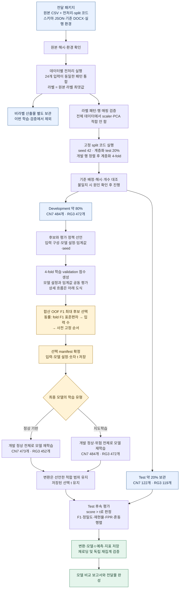
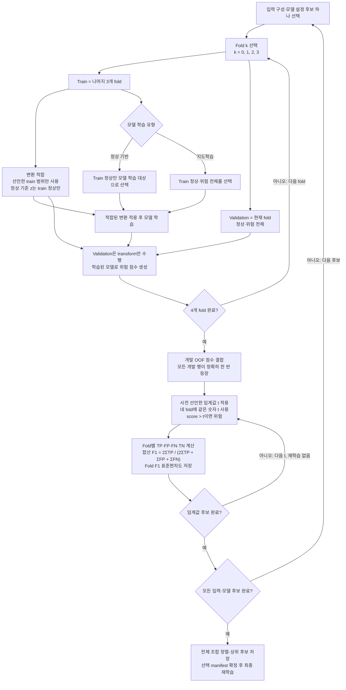

# CN7·RG3 다른 모델 적용을 위한 모델링·학습·검증 매뉴얼

작성일: 2026-09-29 · 버전: 1.2 (전체 흐름 및 탐색 상세 도식 추가)

이 문서는 원본 데이터와 전처리·분할 코드를 전달받아 CN7·RG3에 새로운 모델을 적용하는 담당자를 위한 실행 기준이다. **원본 → 전처리 코드 → 분할 코드 → 모델링** 순서로 재현한다. 분할된 CSV는 코드 실행 산출물이며 필수 전달 입력이 아니다. 기존 OCSVM의 학습 방식을 모든 모델에 그대로 적용하지 않고, **데이터·분할·평가 규칙은 공통으로 유지하고 학습 대상과 모델 파라미터는 모델 종류에 맞게 바꾼다.**

현재 기준 구현은 [CN7 통합 노트북](ocsvm_cn7_integrated.ipynb)과 [RG3 통합 노트북](ocsvm_rg3_integrated.ipynb)이다. 두 노트북에는 모델링 함수, 회귀 테스트, 결과 감사 코드가 모두 포함되어 있다. 새로운 모델은 별도 노트북과 별도 출력 폴더에 구현한다.

## 전체 과정 도식

아래 흐름을 CN7과 RG3에 각각 독립 적용한다. 분할 CSV는 코드 실행 결과이며, 원본과 전처리·분할 코드가 전달 기준이다.



**Test는 후보 선택·임계값 조정에 연결하지 않는다.** 기존 분석에서 관찰된 test이므로 최종 결과는 후속 평가로 표시한다. 지도학습도 정상 기준 도메인 변환을 쓰는 경우 그 변환만 개발 정상으로 적합하고, 분류기는 개발 전체로 학습한다. 해시·분할 검증에 실패하면 기존 기준을 임의로 갱신하지 않는다.

### 4-fold 학습과 F1 공동 탐색 상세



- 선택 단위는 **입력 구성 + 모델 설정 + 숫자 t**다. Fold마다 최적 t를 따로 선택하지 않는다.
- 동률은 F1 표준편차(`ddof=1`), 최대 입력 수, 후보 ID, `abs(t)`, 높은 t 순으로 처리한다. AP·FPR은 보조 지표이며 선택 필터가 아니다.
- 학습 실패 fold를 빼고 성능을 집계하지 않는다. 모든 후보 F1이 0이면 불량 탐지 근거를 확보하지 못한 것으로 보고한다.
- 조기 종료가 필요하면 해당 train 내부 절차로 별도 선언한다. 일률적인 65:35 임계값 보정 분할은 추가하지 않는다.

## 1. 담당자가 먼저 확정할 사항

| 항목 | 공통 기준 / 담당자의 작업 |
|---|---|
| 학습 단위 | 전처리된 고유 입력 패턴 1행. 원본 중복 행으로 되돌려 학습하지 않는다. |
| 데이터 구분 | CN7과 RG3를 별도 학습·탐색·평가한다. 두 데이터에서 같은 파라미터를 선택할 필요는 없다. |
| 분할 | 전달된 분할 코드로 고정 test와 개발 4-fold를 생성한다. 모델별로 seed·행 순서·분할 정책을 바꾸지 않는다. |
| 학습 유형 | 정상 기반 이상 탐지인지, 정상·불량을 함께 학습하는 지도학습인지 먼저 선언한다. |
| 주 선택 지표 | **개발 4-fold의 TP·FP·FN을 합산한 OOF F1 최대화** |
| 판정 규칙 | 위험 점수가 클수록 불량이며 `risk_score > threshold`이면 1 |
| 탐색 대상 | 모델 파라미터 + 숫자 임계값 + 사전에 정의한 입력 구성 |
| 동률 | fold별 F1 표준편차가 작은 후보 → 입력 수가 적은 후보 → 고정된 후보 순서 |
| 사용하지 않는 선택 규칙 | AP 최대화, FPR 상한으로 후보 제외, test 성능으로 후보 재선택 |
| 최종 적합 | 선택한 설정으로 개발 학습 대상 전체를 다시 학습하고 선택한 임계값을 그대로 적용 |
| 재현성 | 후보 목록, seed, 데이터·분할 해시, 라이브러리 버전, 최종 설정 및 예측 저장 |

F1은 현재 프로젝트에서 합의한 비교 기준이며 공식 대회 채점 지표나 실제 공정 비용의 최적값이라는 의미는 아니다. FPR·정밀도·재현율·AP 등은 결과 해석에 함께 제시한다. 이후 평가 목표를 바꾸면 기존 실험과 구분되는 새 실험으로 기록한다.

## 2. 전달 자료와 데이터 해석

### 2.1. 전달 패키지와 실행 순서

필수 전달물은 다음과 같다. 원본은 이 프로젝트에서 제공받은 CSV를 뜻하며, 물리 단위의 센서 원시값이 복원된 자료라는 뜻은 아니다.

| 전달물 | 경로 / 역할 |
|---|---|
| 원본 CSV 4개 | `data/origin/moldset_labeled_cn7.csv`, `moldset_unlabeled_cn7.csv`, `moldset_labeled_rg3.csv`, `moldset_unlabeled_rg3.csv` |
| CN7 전처리 코드 | [preprocess_cn7_conservative.ipynb](../preprocessing/preprocess_cn7_conservative.ipynb) |
| RG3 전처리 코드 | [preprocess_rg3_conservative.ipynb](../preprocessing/preprocess_rg3_conservative.ipynb) |
| 공통 분할 코드 | [split_conservative_data.ipynb](../preprocessing/split_conservative_data.ipynb) |
| 현재 전처리 코드의 입력 스키마 의존 파일 | `data/processed/cn7/preprocessing_manifest.json`, `data/processed/rg3/preprocessing_manifest.json`의 `feature_columns`를 읽음 |
| 현재 전처리 코드의 문서 의존 파일 | `output/conservative_process_strategy/`의 기준 `.docx`를 읽어 출처 해시에 포함 |
| 모델링 기준 | 이 매뉴얼과 참고용 CN7·RG3 통합 노트북 |
| 재현 환경·기준 기록 | Python·numpy·pandas·scikit-learn 버전과 원본 해시, 기존 분할 manifest 및 배정표의 검증용 사본 |

**현재 전처리 노트북은 원본 CSV만으로 독립 실행되는 상태가 아니다.** 위 스키마 JSON과 기준 문서도 함께 전달해야 한다. 이 두 의존성을 코드 내부 정의·선택적 참고 자료로 정리하기 전에는 패키지에서 제외하지 않는다. 비라벨 파일도 현재 전처리 코드의 필수 입력이지만 모델 학습·평가에는 사용하지 않는다.

실행 순서:

1. 전달받은 폴더 구조를 유지하고 원본 파일의 SHA-256 및 실행 환경을 확인한다.
2. 두 전처리 노트북을 각각 새 커널에서 전체 실행한다. 동일한 24개 입력의 패턴 통합과 라벨 집계, 원본 행 매핑 검증을 완료한다.
3. 공통 분할 노트북을 실행한다. `SEED=42`, `TEST_SIZE=0.2`, `N_SPLITS=4`를 유지한다. 계층화 holdout 후 개발 인덱스를 `pattern_row` 오름차순으로 정렬하고, `shuffle=True`, `random_state=42`의 계층화 4-fold를 생성한다.
4. 생성 결과를 아래 개수 및 별도로 보존한 기준 배정표와 대조한다. Seed가 같다는 사실만으로 동일 분할이라고 판단하지 않는다. 원본·패턴 순서·라이브러리 버전도 확인한다.
5. 모델링 노트북은 생성된 전처리·분할 결과를 읽고 학습·탐색을 시작한다. 모든 모델은 이 배정을 공유한다.

동일 입력 패턴이 train/test 양쪽에 들어가는 것을 막기 위해 **패턴 통합 후 분할**한다. 이 단계에서는 scaler·PCA·특징 선택을 전체 자료에 적합하지 않는다. 그런 변환은 분할 이후 각 train에서만 적합한다.

분할 CSV 전체를 전달할 필요는 없다. 기존 결과와의 비교를 검증할 작은 기준 배정표·manifest는 `reference/` 등 생성 경로와 다른 위치에 보관할 수 있다. 처음 생성한 산출물끼리의 해시 일치만으로 과거 실험이 재현되었다고 판단하지 않는다. 모델마다 유리한 split을 다시 뽑는 것은 허용하지 않는다.

### 2.2. 코드 실행 후 생성되는 폴더

```text
data/processed/cn7/conservative/
data/processed/rg3/conservative/
```

두 전처리 노트북과 공통 분할 노트북이 위 폴더 및 `splits/`를 생성한다. 상위 경로의 다른 전처리 버전 또는 예전 3-fold 파일과 섞지 않는다. 현재 전처리·분할 코드는 `data/origin/`이 있는 상위 폴더를 프로젝트 루트로 찾는다. 생성된 CSV를 참고용으로 함께 전달하더라도 원본과 코드가 재현의 기준이다.

| 파일 | 모델링에서의 용도 |
|---|---|
| `X_labeled.csv` | 라벨 있는 패턴의 입력 24개. 컬럼 순서를 유지한다. |
| `y_labeled.csv` | 같은 행 순서의 `PassOrFail` 라벨 |
| `labeled_metadata.csv` | `pattern_row`, `pattern_id`, 관측 유형과 원본 관측 횟수 등. 진단·추적용 |
| `preprocessing_manifest.json`, `validation.json` | 전처리 정책, 컬럼 정의, 품질 확인 |
| `splits/split_assignments.csv` | development/test 및 개발 fold 배정의 기준 파일 |
| `splits/split_manifest.json` | 분할 정책과 입력·분할 산출물 SHA-256 |
| `splits/fold_indices.json`, `fold_summary.csv` | fold 인덱스와 개수 확인용 |
| `splits/X_development.csv` 등 | 분할된 편의 자료. 원본 패턴 인덱스와 위치 인덱스를 혼동하지 않는다. |
| `source_row_mapping.csv` | 패턴 결과를 라벨 원본 행으로 연결할 때 사용 |
| `X_unlabeled.csv`, `unlabeled_metadata.csv`, `unlabeled_source_row_mapping.csv` | 비라벨 추론을 별도로 수행할 때 사용. 현재 학습·검증에는 포함하지 않는다. |

`preprocessing_manifest.json`의 `split_status`는 전처리 생성 시점에 “미분할”로 기록되어 있다. **현재 분할의 기준은 후속 생성된 `splits/split_manifest.json`과 `split_assignments.csv`**이다.

### 2.3. 라벨의 의미

- `0`: 해당 입력 패턴에서 관측된 불량 이력이 없음.
- `1`: 해당 입력 패턴에서 불량이 한 번 이상 관측됨.
- 같은 24개 입력을 가진 원본 행을 하나의 패턴으로 통합했고, 패턴 라벨은 원본 라벨의 최댓값이다.
- 따라서 모델의 목표는 **불량 이력이 있는 입력 패턴 탐지**다. 단일 제품의 실제 불량 확률을 직접 예측하거나, 원본 불량률을 추정하는 문제와 구분한다.
- CN7 위험 패턴 14개 중 11개는 정상·불량 공존, 3개는 불량 전용이다. RG3 위험 패턴 25개는 모두 정상·불량 공존이다.
- `pattern_type`, 불량 관측 횟수, 원본 라벨 요약 등의 메타데이터를 입력 변수로 넣지 않는다. `pattern_id`, `pattern_row`, 원본 ID, fold·partition도 모델 입력이 아니다.
- 패턴마다 기본 평가 가중치는 1이다. 원본 관측 횟수로 자동 가중하지 않는다. 별도의 가중 실험이 필요하면 목적과 가중치 산출 시점을 명시한다.

### 2.4. 분할 개수

| 데이터 | 전체 정상 / 위험 | 개발 정상 / 위험 | Test 정상 / 위험 |
|---|---:|---:|---:|
| CN7 | 592 / 14 = 606개 | 473 / 11 = 484개 | 119 / 3 = 122개 |
| RG3 | 566 / 25 = 591개 | 452 / 20 = 472개 | 114 / 5 = 119개 |

| 데이터·validation fold | Validation 정상 / 위험 | 해당 train 정상 / 위험 |
|---|---:|---:|
| CN7 fold 0 | 119 / 2 | 354 / 9 |
| CN7 fold 1·2·3 각각 | 118 / 3 | 355 / 8 |
| RG3 fold 0·1·2·3 각각 | 113 / 5 | 339 / 15 |

`pattern_row`와 `fold_indices.json`의 인덱스는 `X_labeled.csv` 전체의 0부터 시작하는 위치다. 이를 행 수가 줄어든 `X_development.csv.iloc[...]`에 그대로 적용하면 안 된다. 권장 방식은 **전체 X·y를 읽고 `pattern_row`로 `.iloc` 접근**하는 것이다.

## 3. 데이터 로드와 필수 확인

아래 코드는 입력·분할 계약을 확인하는 예시이며 모델 학습 코드는 아니다. 이 확인 과정에서 전체 파일을 읽는 것과, test를 모델 선택에 사용하는 것은 다르다. 탐색 함수에는 development만 전달한다.

```python
from pathlib import Path
import hashlib
import json
import numpy as np
import pandas as pd

def load_modeling_data(root, dataset):
    if dataset not in {"cn7", "rg3"}:
        raise ValueError(dataset)
    folder = Path(root) / "data/processed" / dataset / "conservative"
    split_dir = folder / "splits"
    manifest = json.loads((split_dir / "split_manifest.json").read_text(encoding="utf-8"))
    pre = json.loads((folder / "preprocessing_manifest.json").read_text(encoding="utf-8"))
    def sha256(path):
        return hashlib.sha256(path.read_bytes()).hexdigest()
    for filename, expected in manifest["source_sha256"].items():
        assert sha256(folder / filename) == expected, filename
    for filename, expected in manifest["artifact_sha256"].items():
        assert sha256(split_dir / filename) == expected, filename

    X = pd.read_csv(folder / "X_labeled.csv", float_precision="round_trip")
    y = pd.read_csv(folder / "y_labeled.csv")["PassOrFail"]
    assignment = pd.read_csv(split_dir / "split_assignments.csv")
    assert list(X.columns) == pre["feature_columns"] and X.shape[1] == 24
    assert len(X) == len(y) == len(assignment)
    assert np.isfinite(X.to_numpy()).all() and not X.duplicated().any()
    assert np.array_equal(assignment.pattern_row, np.arange(len(X)))
    assert np.array_equal(assignment.label, y) and set(y) == {0, 1}
    assert assignment.pattern_id.is_unique
    dev = assignment.loc[assignment.partition.eq("development"), "pattern_row"].to_numpy()
    test = assignment.loc[assignment.partition.eq("test"), "pattern_row"].to_numpy()
    assert not set(dev) & set(test)
    assert set(dev) | set(test) == set(range(len(X)))
    assert set(assignment.loc[dev, "cv_fold"]) == {0, 1, 2, 3}
    assert assignment.loc[test, "cv_fold"].eq(-1).all()
    return X, y, assignment, dev, test

# ROOT는 호출 측에서 지정한 프로젝트 루트입니다.
# 예: ROOT = Path.cwd()  # 프로젝트 루트에서 실행할 때
# X, y, assignment, dev, test = load_modeling_data(ROOT, "cn7")
```

해시 불일치나 행 정렬 불일치가 발견되면 자동으로 다시 분할하지 말고 전달 자료의 버전을 확인한다. 새 모델 실험 때문에 전처리 CSV를 덮어쓰지 않는다.

## 4. 모델 종류에 따른 학습 대상

| 구분 | Fold에서 모델이 학습하는 자료 | Validation | 최종 재학습 |
|---|---|---|---|
| 정상 기반 이상 탐지 | 해당 train의 정상만 | 해당 validation의 정상·위험 전체 | 개발 정상 전체: CN7 473개, RG3 452개 |
| 지도학습 이진 분류 | 해당 train의 정상·위험 모두 | 해당 validation의 정상·위험 전체 | 개발 전체: CN7 484개, RG3 472개 |

정상 기반 모델에는 OCSVM과 정상 학습을 전제로 설계한 이상 점수 모델 등이 해당한다. 지도학습 모델에는 로지스틱 회귀, 트리 기반 분류기 등 라벨을 학습하는 모델이 해당한다. 모델 이름만으로 학습 정책을 암묵적으로 정하지 말고 실험 설정에 `training_mode`를 기록한다.

지도학습 모델을 정상만으로 학습하면 불량 클래스의 분류 경계를 학습할 수 없다. **OCSVM의 `y_train == 0` 필터를 지도학습 코드에 그대로 복사하지 않는다.** 반대로 정상 기반 이상 탐지에 위험 패턴을 자동으로 섞어 학습하지 않는다.

불균형 대응이 필요하면 클래스 가중치·학습 내 재표본화 등을 별도 후보로 정의할 수 있다. 가중치 산출과 재표본화는 해당 train 안에서만 수행한다. Validation/test의 비율과 행은 변경하지 않는다. 기본 비교에서는 원본 패턴을 동일 가중치로 평가한다.

## 5. 모델용 변환과 입력 구성

### 5.1. 전달된 전처리와 모델 적합용 변환의 구분

전처리 코드의 산출물은 패턴 통합까지 완료했지만, 후속 모델의 scaler·상수 제거·PCA·특징 선택은 적합하지 않았다. 이 변환들은 모델링 담당자가 fold 안에서 적합한다.

| 작업 | 적합에 사용할 자료 | Validation/test에서 할 일 |
|---|---|---|
| 일반 scaler·결측 대체·상수 제거 | 정상 기반 모델은 정상 train, 지도학습은 해당 train 전체를 기본으로 하되 정책 명시 | 저장된 변환의 transform만 수행 |
| 현재 도메인 파생변수의 정상 기준 z | 해당 train의 정상만. “정상 대비 편차”라는 정의를 유지 | 같은 정상 평균·표준편차 사용 |
| PCA | 해당 실험에서 정한 train 적합 범위 | 같은 PCA로 transform |
| 라벨을 쓰는 특징 선택 | 해당 train의 X·y만 | 선택된 열만 적용 |
| 클래스 가중치·재표본화 | 해당 train만 | 적용하지 않고 원래 분포로 평가 |

CN7·RG3 통합 노트북의 `fit_features`는 정상 기준 변환이다. 지도학습에서도 이 함수를 재사용할 수 있지만, “정상 기준 입력 표현을 사용했다”는 정책을 명시하고 **변환된 정상·위험 train 전체로 분류기를 학습**한다. 일반적인 train 전체 표준화로 바꾸면 다른 입력 표현 실험으로 기록한다.

Train에 없는 범위의 값이 validation/test에 나타나더라도 이를 근거로 scaler를 재적합하거나 해당 행을 삭제하지 않는다. 센서의 활성 여부와 상수 열 제거도 train에서만 결정한다. 제공값 자체의 사전 표준화 과정을 여기서 원시 단위로 복원할 수는 없다.

### 5.2. 입력 후보와 도메인 근거

첫 기준 모델은 원변수 전체로 평가한다. 그다음 필요한 경우 기존의 가설군을 비교한다.

| 입력 구성 | 내용 |
|---|---|
| 원변수 | 제공된 24개 입력. 상수 제거 여부·규칙은 train 기준 |
| 형체·주기 제외 비교군 | `Clamp_Close_Time`, `Clamp_Open_Position`, `Cycle_Time` 제외. 필수 삭제 규칙이 아님 |
| 압력 가설군 추가 | z(최대 사출압력) − z(전환압력) |
| 가소화 가설군 추가 | z(최대 RPM) − z(평균 RPM), z(최대 배압) − z(평균 배압) |
| 열 상태 가설군 추가 | 활성 배럴 z 평균·표준편차, 금형 z 평균·차이 |
| 도메인 전체 | 원변수 + 위 가설군 전체 |
| 공정별 PCA 비교군 | 공정군별 최대 2개 PC와, 남는 차원이 있는 경우 재구성 RMSE |

기존 파생변수는 최대 7개이며, 해당 train에서 활성 센서가 2개 미만이면 해당 쌍·집계 변수를 만들지 않는다. 정의와 공정군별 센서 목록은 기준 노트북 B절 및 `DOMAIN_SPEC`, `GROUPS` 셀에 있다.

이 수식은 **정상 대비 상대 변화**를 표현한다. 실제 압력 차이·시간 차이·섭씨 온도차·동력·유량·점도로 해석하지 않는다. 새 파생변수는 입력 센서, 식, 공정 가설, 단위 및 한계를 먼저 기록한 뒤 후보에 추가한다. Test 결과를 보고 조합을 만든 후 같은 test에서 독립적인 개선으로 보고하지 않는다.

모든 새 모델에서 7개 구성을 반드시 탐색할 필요는 없다. 어떤 입력 구성을 비교했는지 명시한다. 같은 입력에서 모델만 바꾼 비교와, 입력 구성까지 함께 최적화한 비교는 구분해 보고한다.

## 6. 위험 점수와 임계값 정의

모델별 점수 출력을 다음 계약에 맞춘다.

```python
risk_score = score_model(fitted_model, transformed_inputs)
prediction = (risk_score > threshold).astype(int)
```

1. 점수는 입력 행과 같은 순서의 유한한 1차원 배열이어야 한다.
2. 높은 값이 불량 위험을 뜻하도록 방향을 통일한다. 정상도 점수가 큰 모델이면 부호를 반전한다.
3. 확률을 쓰면 **라벨 1의 확률**을 사용한다. 라이브러리의 클래스 순서를 확인하고 두 번째 열을 무조건 선택하지 않는다.
4. `-1/+1` 라벨을 반환하는 이상 탐지 모델의 기본 예측을 그대로 `0/1`로 오해하지 않는다. 임계값 탐색에는 가능하면 연속 점수를 사용한다.
5. 점수가 확률인지, decision score인지, 재구성 오차인지 기록한다. 이상 점수를 불량 확률이라고 부르지 않는다.
6. 동점은 `score == t`이면 정상으로 분류한다. 학습·검증·최종 추론에서 `>`와 `>=`를 섞지 않는다.

임계값은 모델 파라미터와 함께 validation에서 선택하는 튜닝 파라미터다. 임계값만 바뀔 때 모델을 다시 학습할 필요는 없다.

**OCSVM의 임계값 목록을 다른 모델에 무조건 복사하지 않는다.** 확률 출력 모델은 예를 들어 `[0, 0.01, ..., 1.00]`처럼 점수 범위에 맞는 후보를 사전 고정할 수 있다. 이는 시작 예시이지 공통 의무 범위가 아니다. 원시 이상 점수는 모델별 척도에 맞춰 범위·간격을 선언한다. 기본 경계와 탐색 경계값 여부도 기록한다.

새 모델에서 점수 정규화 또는 확률 보정을 추가한다면 그 적합 자료와 시점을 정의한다. Validation/test 전체를 이용해 점수 척도를 맞추지 않는다. 같은 숫자 t를 fold와 최종 모델에 적용해도 재학습에 따른 척도 변화가 생길 수 있으므로 최종 평가는 필요하다.

## 7. 하이퍼파라미터 탐색 규칙

### 7.1. 탐색 전에 기록할 설정

- 데이터 이름, 모델 이름, `training_mode`, 입력 구성 목록.
- 모델에 맞는 하이퍼파라미터 후보와 조건부 조합. 해당 모델에 없는 `nu`, `gamma`를 재사용하지 않는다.
- 임계값 후보 목록, 점수 정의·방향, 판정 연산자.
- 전처리·PCA·불균형 대응·조기 종료 정책.
- seed 또는 seed 목록, 최대 반복/epoch, 수렴 실패 처리.
- 주 지표 `pooled OOF F1`, 동률 처리 규칙, 탐색 횟수·계산 예산.

OCSVM의 616개 모델 설정 또는 401,016개 전체 조합은 해당 실험의 범위다. 다른 모델도 같은 개수를 맞출 필요는 없다. 대신 비교 보고서에 각 모델의 실제 탐색 수와 계산량을 공개한다. 탐색 범위를 크게 달리한 결과를 모델 구조 차이만으로 설명하지 않는다.

확률적 학습은 최소한 seed를 고정한다. 여러 seed를 비교하면 사전에 목록과 집계 방식을 정하고 분포를 보고한다. 잘 나온 seed만 골라 대표값으로 숨기지 않는다.

### 7.2. 한 후보의 4-fold 평가

아래는 모델에 맞게 구현할 **의사코드**다. `fit_transformer`, `fit_model`, `risk_score`는 담당 모델에 맞게 작성해야 한다.

```text
각 데이터(CN7, RG3)에 대해 독립적으로:
  test는 보관하고 development만 탐색 함수에 전달
  각 입력 구성과 모델 파라미터 조합에 대해:
    fold 0~3 각각:
      valid = development 중 현재 fold의 모든 행
      train = development 중 나머지 fold의 모든 행
      정상 기반이면 model_fit_rows = train의 정상 행
      지도학습이면 model_fit_rows = train 전체
      정한 정책대로 train에서만 변환 적합
      변환된 model_fit_rows로 모델 학습
      valid를 transform하여 위험 점수 저장
    사전 고정한 각 임계값 t에 대해:
      네 fold 점수에 동일한 t 적용
      fold별 TP, FP, FN, TN과 F1 계산
      네 fold의 TP, FP, FN을 합산해 OOF F1 계산
      OOF F1, fold F1 표준편차, 보조 지표와 후보 설정 저장
  모든 조합을 공통 선택 규칙으로 정렬
  1위 설정 및 상위 후보를 저장하고 선택 확정
```

각 개발 행은 validation에 정확히 한 번 등장해야 한다. Fold마다 최적 임계값을 따로 고른 뒤 그 네 성능을 합치거나 임계값을 평균하지 않는다. 비교 단위는 **하나의 입력 구성·모델 설정·숫자 t**다.

수렴 실패·비유한 점수·부족한 클래스 등 오류가 나면 원인을 기록한다. 실패한 fold를 빼고 남은 fold만으로 후보 점수를 계산하지 않는다. 전체 실행을 중단해 수정하거나 해당 후보 전체를 실패 처리하는 정책을 사전에 정한다.

### 7.3. F1 및 동률 처리

```text
TP = 실제 1을 1로 예측한 수
FP = 실제 0을 1로 예측한 수
FN = 실제 1을 0으로 예측한 수
TN = 실제 0을 0으로 예측한 수

OOF F1 = 2 × sum(TP) / [2 × sum(TP) + sum(FP) + sum(FN)]
```

분모가 0이면 F1을 0으로 둔다. 정밀도·재현율의 정의되지 않는 분모도 일관되게 0으로 처리한다. 표준편차는 네 fold F1의 표본 표준편차(`ddof=1`)를 사용한다.

정렬 순서는 다음과 같다.

1. 합산 OOF F1 내림차순.
2. 동률이면 fold F1 표준편차 오름차순.
3. 그래도 같으면 실제 입력 수 오름차순. Fold별 입력 수가 다르면 최대값을 쓰고 전체 목록도 저장한다.
4. 이후에는 사전 고정한 후보 ID 순서로 결정한다. 같은 모델에서 t만 동률이면 `abs(t)`가 작은 값, 그다음 높은 t를 사용한다. 이는 재현용 규칙이며 통계적 성능 우위를 뜻하지 않는다.

AP·FPR·재현율 등을 숨은 추가 정렬 기준으로 넣지 않는다. 전체 후보의 F1이 0이면 불량 탐지 근거를 확보하지 못한 실험으로 보고하고, 임의의 후보를 검증된 최적 모델로 제시하지 않는다.

합산 OOF F1과 평균 fold F1은 서로 다르다. 평균 fold F1은 참고값으로 표시하고 선택 지표 명칭을 섞지 않는다. 개발 불량이 CN7 11개·RG3 20개뿐이므로 1개 판정 변화의 영향이 크다. 상위 20개 후보와 fold별 혼동행렬을 함께 전달한다.

### 7.4. 조기 종료가 있는 모델

가장 단순한 공통 비교는 반복 횟수/epoch를 후보로 두고 고정 횟수로 학습하는 것이다. 조기 종료를 사용한다면 감시 자료는 바깥 validation이 아닌 **해당 train 내부**에서 정하고, 분할 정책을 기록한다. 이는 모델 학습을 위한 내부 절차이며 임계값 보정을 위해 일률적으로 정상 train을 65:35로 나누는 규칙이 아니다.

바깥 validation을 조기 종료와 성능 평가에 함께 쓰면 그 자료를 학습 제어에도 이용한 것이다. 이 경우 단순한 “학습에 사용하지 않은 validation 평가”로 보고하지 않는다. 최종 재학습의 반복 횟수 결정도 development에서 완료하고 test로 조기 종료하지 않는다.

## 8. 선택 확정과 최종 평가

1. Test 점수를 계산하기 전에 선택한 입력 구성·모델 파라미터·t·seed·변환 정책을 manifest에 저장한다.
2. 모델은 정상 기반이면 개발 정상 전체, 지도학습이면 개발 전체로 다시 적합한다. 변환은 탐색 때 선언한 적합 범위를 유지한다. 예를 들어 지도학습에서도 정상 기준 z 변환은 개발 정상 전체로 적합하고, 분류기는 변환된 개발 전체로 학습한다.
3. Validation에서 선택한 숫자 t를 그대로 적용한다. Test 점수 분포·라벨로 t를 변경하지 않는다.
4. Test의 TP·FP·FN·TN, F1, 정밀도, 재현율, FPR을 저장한다. AP·ROC-AUC는 참고용으로 추가할 수 있다.
5. 입력 컬럼 순서, 변환 객체, 모델, 점수 방향, t, 버전 및 선택 manifest 식별자를 함께 저장한다.
6. 저장 파일을 다시 읽어 동일 입력의 점수·예측이 같음을 확인한다. 허용 오차가 필요한 모델은 그 값을 명시하고 판정 일치도 별도로 검사한다.
7. 원본 관측 유형별 오류를 확인하되 메타데이터를 학습 입력으로 되돌려 넣지 않는다.

모델별 test 결과를 표로 비교할 수는 있지만, 그 표를 보고 모델·하이퍼파라미터·입력·t를 다시 고르면 test가 선택에 사용된 것이다. **모델 종류 간 대표 모델 선택도 development F1 기준으로 먼저 확정**한다. 사후 test 비교는 후속 평가로 표시한다.

현재 고정 test는 OCSVM 등 기존 분석에서 이미 관찰되었다. 새 모델에서도 이를 완전히 새로운 독립 holdout이라고 표현하지 않는다. 엄밀한 일반화 성능 추정은 별도의 새 자료 또는 사전에 설계한 추가 검증이 필요하다. 이 매뉴얼 작업에서 고정 분할을 자동으로 바꾸지는 않는다.

## 9. 모델 비교표와 산출물

### 9.1. 저장 위치

```text
modeling/<model_name>_cn7_integrated.ipynb
modeling/<model_name>_rg3_integrated.ipynb
output/<model_name>_<dataset>/<experiment_id>/
```

노트북은 필요한 프로젝트 코드를 셀에 포함하고 새 커널에서 위부터 전체 실행할 수 있게 한다. 기존 OCSVM 노트북·출력·전처리 자료를 덮어쓰지 않는다.

| 산출물 | 포함할 정보 |
|---|---|
| `run_config.json` | 데이터·분할·코드 해시, 모델/학습 유형, 후보 목록, 버전, seed, 변환 정책 |
| `fold_plan.json` | 원본 패턴 기준 train/model-fit/validation 행. 지도학습·정상 기반 차이가 드러나야 함 |
| `feature_audit.json` | fold별 입력 열, 상수 제거, 파생변수·PCA 등 적합 정보 |
| `threshold_search.csv` | 전체 모델 설정·t별 OOF F1, fold F1 표준편차, 보조 지표 |
| `candidate_search.csv` | 모델 설정별 F1 최선 t 결과 |
| `candidate_fold_metrics.csv` | 후보별 평가에 사용된 fold 지표 |
| `top_joint_candidates.csv`, `top_model_candidates.csv` | 전체 조합 및 모델별 대표 후보 상위 20개 |
| `selection_manifest.json` | test 전 확정한 설정, 선택 지표·동률 규칙, 선택에 test 미사용 여부 |
| `selected_oof_predictions.csv` | 모든 개발 행의 fold·정답·점수·t·예측 |
| `selected_fold_metrics.csv` | 선택 후보의 fold별 혼동행렬·F1·보조 지표 |
| `final_fit_plan.json` | 최종 적합에 사용한 개발 행과 학습 유형 |
| `test_predictions.csv`, `test_metrics.csv` | test 행별 결과 및 집계 성능 |
| 모델 bundle | 컬럼·변환·모델·점수 방향·t를 함께 복원할 수 있는 저장물 |
| `verification.json`, `postrun_audit.json` | 검증 항목별 결과와 산출물 해시 |
| `analysis_summary.md` | 선택 이유, 상위 후보 차이, 개발/test 결과와 해석 한계 |

파일명은 위 기준을 권장하며 모델에 따라 보완할 수 있다. 행 인덱스는 항상 `pattern_row`로 추적 가능해야 한다. 전체 후보 결과가 크더라도 최선 결과만 남겨 선택 근거가 사라지게 하지 않는다.

### 9.2. 보고서 표

| 데이터 | 모델/학습 유형 | 입력 구성 | 탐색 조합 수 | OOF F1 | Fold F1 표준편차 | OOF TP/FP/FN | 선택 t | Test F1 | Test TP/FP/FN |
|---|---|---|---:|---:|---:|---|---:|---:|---|
| CN7 | 새 모델 | 작성 | 작성 | 실행 후 | 실행 후 | 실행 후 | 실행 후 | 실행 후 | 실행 후 |
| RG3 | 새 모델 | 작성 | 작성 | 실행 후 | 실행 후 | 실행 후 | 실행 후 | 실행 후 | 실행 후 |

재현율만 높거나 F1만 소폭 상승했다는 이유로 운영 적합성을 단정하지 않는다. 오탐 수·불량 수와 함께 해석한다. 비교용으로 “전부 정상”, “전부 위험” 판정의 F1도 제시하면 다수 경보만으로 얻은 성능인지 확인하는 데 도움이 된다. 이 기준선은 하이퍼파라미터 선택을 대체하지 않는다.

## 10. 현재 OCSVM 비교 기준

아래는 2026-09-29에 현재 통합 노트북에서 확인한 결과다. 새 모델의 목표값이나 합격선이 아니라 동일 데이터·분할에서 얻은 비교 기록이다. CN7의 `legacy_without_cycle`과 RG3의 `without_cycle`은 동일한 형체·주기 제외 구성을 뜻한다.

| 데이터 | 선택 입력 | nu | gamma 배수 | t | 개발 OOF F1 | 개발 TP/FP/FN | Test F1 | Test TP/FP/FN/TN |
|---|---|---:|---:|---:|---:|---|---:|---|
| CN7 | 형체·주기 제외 | 0.001 | 0.0385388107 | 0.0025118864 | 0.500000 | 4 / 1 / 7 | 0.000000 | 0 / 0 / 3 / 119 |
| RG3 | 공정별 PCA | 0.07 | 10.0 | 0.0398107171 | 0.088578 | 19 / 390 / 1 | 0.101010 | 5 / 89 / 0 / 25 |

gamma는 위 배수를 실제 입력 수로 나눈 값이다. 표의 반올림 수치를 코드에 복사하지 말고 원본 선택 manifest의 값을 사용한다. CN7은 test 불량을 놓쳤고, RG3는 test 불량을 모두 잡았지만 정상 89개를 오탐했다. 따라서 두 결과 모두 실용적인 판별 성능 개선을 확인한 상태로 보기는 어렵다.

기준 결과:

- [CN7 선택 설정](../output/ocsvm_cn7_integrated/validation_f1_20260929/selection_manifest.json), [CN7 test 지표](../output/ocsvm_cn7_integrated/validation_f1_20260929/test_metrics.csv)
- [RG3 선택 설정](../output/ocsvm_rg3_integrated/validation_f1_20260929/selection_manifest.json), [RG3 test 지표](../output/ocsvm_rg3_integrated/validation_f1_20260929/test_metrics.csv)

## 11. 완료 확인표

- [ ] 원본·전처리 코드·분할 코드·현재 코드의 의존 파일·실행 환경을 전달받았다.
- [ ] 전처리·분할 코드를 순서대로 실행하고 파일·해시·컬럼 순서·라벨·분할 개수를 확인했다.
- [ ] 생성 배정이 보존된 기준 배정과 같고, CN7·RG3 독립 학습 및 모델 간 공통 분할을 유지했다.
- [ ] 학습 유형에 맞는 train 행을 사용했다. 지도학습에서 위험 train 행을 누락하지 않았다.
- [ ] 모든 적합·가중치·재표본화·특징 선택은 해당 train 범위 안에서 수행했다.
- [ ] 점수 방향, 라벨 1의 의미, `score > t` 규칙을 확인했다.
- [ ] 모든 개발 행이 OOF 평가에 정확히 한 번 포함된다.
- [ ] 동일 후보의 같은 숫자 t를 네 fold에 적용했다.
- [ ] OOF F1을 혼동행렬 합계에서 다시 계산했고 fold 평균과 구분했다.
- [ ] FPR·AP·test 지표가 선택 필터나 숨은 동률 기준에 들어가지 않았다.
- [ ] 실패 후보를 기록했으며 실패 fold만 빼고 성능을 계산하지 않았다.
- [ ] 상위 후보, fold별 성능, 전체 탐색 범위를 저장했다.
- [ ] Test 평가 전에 선택 manifest를 확정했다.
- [ ] 최종 모델은 올바른 개발 전체 범위로 재학습했고 t를 바꾸지 않았다.
- [ ] 저장 모델 재로딩 점수·예측이 재현된다.
- [ ] 새 커널에서 노트북 전체 실행 및 내부 검증을 통과했다.
- [ ] 원본 CSV와 기존 비교 기준을 보존했으며, 생성한 전처리·분할 산출물을 기존 기록과 검증했다.
- [ ] 반복 관찰한 test의 후속 평가라는 한계를 보고서에 표시했다.

비라벨 예측은 이번 모델 비교와 별도 작업이다. 라벨/비라벨 자료의 파일별 표준화 좌표계 정합이 확인되지 않았으므로 `X_unlabeled.csv`를 정상 자료라고 가정해 학습에 추가하거나 곧바로 운영 성능을 주장하지 않는다. 추론을 진행하려면 좌표계·적용 범위 확인과 원본 행 복원 정책을 먼저 정한다.

## 12. 근거 파일과 유지 관리

- [CN7 전처리 설명](../data/processed/cn7/conservative/README.md), [CN7 분할 manifest](../data/processed/cn7/conservative/splits/split_manifest.json)
- [RG3 전처리 설명](../data/processed/rg3/conservative/README.md), [RG3 분할 manifest](../data/processed/rg3/conservative/splits/split_manifest.json)
- [CN7 통합 노트북](ocsvm_cn7_integrated.ipynb), [RG3 통합 노트북](ocsvm_rg3_integrated.ipynb)

데이터·분할·평가 목적이 바뀌면 이 문서의 버전과 비교 기준을 함께 갱신한다. 새로운 모델의 구체적인 라이브러리 API·파라미터 범위는 해당 구현 담당자가 설치 버전에 맞게 확인하고 실험 설정에 남긴다.
