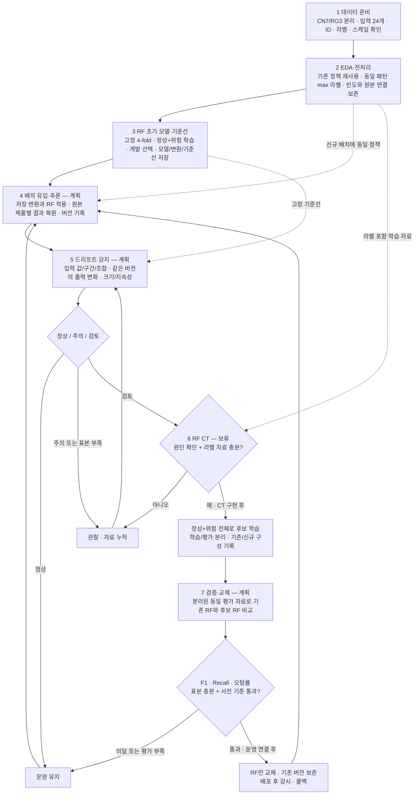

# PNG 7단계 기준 랜덤 포레스트 작업 흐름

기준일: 2026-10-03 · RF 담당: GitHub `seoloo`

사용자가 제공한 `4746acdf44c7fd0d.png`의 「CN7·RG3 드리프트 기반 지속 운영·재학습 파이프라인 — 7단계 개정 기안」을 상위 기준으로 삼는다. 기존 RF 실험은 이 흐름의 3단계에 연결할 수 있는 초기 구현이다. 이미지에 표시된 계획·보류 상태를 구현 완료로 해석하지 않는다. 이 문서는 작업 흐름과 검증 기준이며, 운영 코드 구현 또는 모델 학습 완료 보고서가 아니다.

## 1. 전체 흐름과 RF의 위치

IF의 점수·검사 순위, OCSVM의 정상 기반 위험 판정, RF의 지도학습 판정은 각 모델의 역할이다. PNG는 RF가 IF 점수를 입력 변수로 사용하거나 IF가 위험으로 본 학습 행을 삭제하도록 명시하지 않는다. RF는 기존 24개 입력과 라벨을 사용하며 정상·위험 학습 패턴을 모두 포함한다. 모델 간 비교는 같은 입력·평가 자료를 기준으로 수행한다.

## 2. PNG 단계별 현재 상태와 RF 작업

| PNG 단계 | 현재 코드에서 확인한 상태 | RF 작업 흐름 |
|---|---|---|
| 1 데이터 준비 | 데이터셋별 원본과 24개 입력 스키마 있음. 현장 시간 순서·라벨/비라벨 정합 미확인 | 데이터셋·스키마·라벨·ID·해시를 확인하고 정합 상태 기록 |
| 2 EDA·전처리 | 동일 입력 통합, 최대 라벨, 제품 빈도와 원본 행 연결, 고정 분할 구현 | 팀원 산출물을 검증해 사용. 신규 배치 호출 연결은 계획 |
| 3 초기 모델·기준선 | 기존 RF 7개 구성과 새 RF 전용 실행기 있음. 개발 제품 빈도를 반영한 기준선 저장 구현 | 고유 실행 폴더에서 캐시 없는 학습·저장 모델 감사·기존 결과 비교 |
| 4 배치 유입·추론 | RF 전용 API/CSV 추론 구현. 현장 배치 연결 미검증 | 저장 모델·변환 적용, 원본 빈도·행 연결·버전 보존, 정합 미확인 입력 보류 |
| 5 드리프트 감지 | RF 기준선 대비 값/구간/일부 변수쌍/출력 변화량 제공. 운영 경보 판단 미구현 | 같은 모델 버전으로 비교. 경보선·윈도·지속성·판단은 후속 구현 |
| 6 모델별 CT | 운영 CT 미구현·보류 | 원인·라벨·자료량 조건 충족 후 정상+위험 자료로 후보 학습하는 계약만 정의 |
| 7 검증·교체 | 초기 평가·저장 있음. 기존/후보 운영 비교·승격·롤백 미구현 | 같은 분리 평가 자료의 비교와 RF 개별 교체 흐름 계획 |

## 3. 초기 RF 모델링 절차

1. CN7·RG3를 독립 실행한다. 입력은 `data/schema/input_features.json`의 24개 공정 변수이며 라벨·ID·빈도·패턴 유형·fold 배정을 모델 입력에 넣지 않는다.
2. 기존 `conservative` 전처리와 고정 split 산출물을 검증해 사용한다. 동일 입력에서 불량이 한 번이라도 있으면 위험 이력 라벨 1이다. 개별 제품 불량 확률로 표현하지 않는다.
3. 고정 Test 20%는 유지하고 개발 80%의 4-fold에서 모델·입력 구성·판정 임계값을 선택한다. 현장 시간·그룹 검증은 실제 시간·그룹 정보가 확보된 후 추가하며 원본 행 번호를 생산 시간으로 가정하지 않는다.
4. 원변수 기준 구성과 기존 7개 입력 구성은 재현 기준으로 사용한다. PNG가 특정 하이퍼파라미터를 요구하지 않으므로 기존 탐색 범위를 파이프라인의 필수 조건으로 간주하지 않는다. 범위를 바꾸면 개발 탐색 전에 새 실험 계획을 기록한다.
5. 원변수 구성의 상수 제거는 fold train 전체에서 적합한다. 도메인 z 기준·공정군 PCA가 필요한 구성은 해당 train 정상 데이터에서 적합한다. RF는 변환된 정상·위험 train 전체로 학습한다.
6. 네 validation의 TP·FP·FN을 합산한 OOF F1으로 후보와 임계값을 선택한다. `p > t`를 판정 규칙으로 유지한다. Test에서 임계값을 다시 선택하지 않는다.
7. 선택 후 개발 정상·위험 전체로 최종 적합하고, 저장한 변환·RF·숫자 임계값을 함께 재로드해 Test 후속 평가를 수행한다. 이 최종 적합은 신규 배치 기반 CT가 아니다.
8. 후속 운영 구현에서는 데이터셋·스키마·학습/평가 자료 해시·입력 구성·임계값·환경·모델 버전과 기준선 버전을 추적할 수 있도록 저장한다.

| 데이터 | 고유 라벨 패턴 | 개발 정상 / 위험 | 고정 Test 정상 / 위험 |
|---|---:|---:|---:|
| CN7 | 606 | 473 / 11 | 119 / 3 |
| RG3 | 591 | 452 / 20 | 114 / 5 |

기존 구현: [RF 소스](random_forest_manual.py), [CN7 통합본](random_forest_cn7_integrated.ipynb), [RG3 통합본](random_forest_rg3_integrated.ipynb).

## 4. 배치·기준선·CT 연결 계약

다음은 RF 연결 계약이다. 입력 검증·저장 모델 추론·원본 연결·기준선과 분포 변화량은 `rf_pipeline.py`에 구현했다. 현장 배치 연결, 운영 드리프트 판단, CT와 운영 교체는 후속 대상이다. 팀원 공통 모듈은 수정하지 않는다.

| 구분 | RF 연결 기준 |
|---|---|
| 라벨 포함 배치 | 기존 입력 검증·정확한 패턴 통합·max 라벨·빈도·원본 연결 정책 재사용. 과거 위험 이력을 새 정상 기록으로 덮어쓰지 않음 |
| 비라벨 배치 | 라벨 생성 없음. 스케일 정합 확인 전 자동 투입 보류. 정합 확인 후 추론·감지에만 사용하며 현 CT 학습에서 제외 |
| 추론 | 저장된 입력 변환·RF·임계값 적용. 새 배치로 scaler·PCA·상수 제거를 다시 적합하지 않음 |
| 결과 | 배치·원본 ID·데이터셋·입력·제공 라벨·RF 점수·예측·모델 버전·기준선 버전 연결. 패턴 예측을 원본 행으로 복원하고 제품 빈도 유지 |
| 입력 기준선 | 값별 비율, 고정 온도·압력 구간 비율, 범위 밖 값, 변수 조합 비율. 기준 구간은 기준 자료에서 고정하고 현재 배치마다 다시 설정하지 않음 |
| RF 출력 기준선 | 같은 RF 버전의 위험 점수 분포와 위험 판정 비율. 제품 단위 비율은 원본 연결/빈도로 계산하고 고유 패턴 수를 별도 기록 |
| 드리프트 판단 | 변화 크기·지속성·표본 수를 함께 확인. 지속 입력 변화만으로 검토 가능하며 출력 변화 동반 시 근거 강화. 전체 신규 패턴 비율은 참고 |
| CT 진입 | 변화·원인 확인과 라벨 학습 자료 충분성 확인 후 후보 생성. 공정 이상을 새 정상으로 자동 흡수하지 않음 |
| 후보 학습 | 정상+위험 전체 학습. 기존/신규 비율·기간 정보가 있으면 기간·고유 패턴 수·자료 해시 기록. 고정 Test와 평가 전용 패턴은 학습에서 제외 |
| 기존/후보 비교 | 같은 분리 평가 자료로 F1·Recall·오탐률 비교. 같은 RF 버전의 과거/최근 비교는 데이터 변화, 같은 평가 자료의 기존/후보 비교는 모델 변화로 구분 |
| 교체·롤백 | 사전 기준 통과한 RF만 교체하고 다른 모델 버전 유지. 기존 RF 보존·배포 후 추적·복구 경로 필요 |

드리프트 경보선·윈도 크기·지속성·최소 표본 수·승격 기준은 현재 확정되지 않았다. 구현 시 자연 변동과 표본 규모 검증으로 정하며, 현재 관측된 Test 성능에 맞춰 임의로 설정하지 않는다. PNG의 CT 보류 상태는 유지한다.

## 5. 분할 탐색 결과의 보관·검증

`threshold_search.csv`는 100MB를 넘었기 때문에 사용자 요청으로 분할한 과거 산출물이다. 단일 파일 부재를 데이터 누락이나 모델링 실패로 취급하지 않는다.

- 공유 단위: `threshold_search_part1.csv`, `threshold_search_part2.csv`, `threshold_search_parts.json` 세 파일.
- manifest의 파일 순서대로 해시·바이트 수·헤더·행 수를 확인하고 메모리에서 연결한다. 두 CSV는 동일 탐색 결과의 연속 조각이다.
- 기존 7개 구성 탐색은 데이터셋별 합계 756,756행이다. 새 탐색 범위가 달라지면 새 계획에서 기대 행 수를 계산한다.
- 조각 누락·변조는 오류 처리한다. 대용량 단일 CSV를 복구하거나 커밋해야 검증할 수 있는 구조로 만들지 않는다.
- 기존 reader/writer의 분할 형식을 유지한다. 단일 CSV와 비교하는 과거 회귀 테스트는 RF 담당 코드에서 분할 산출물만으로 검증하도록 보완할 대상이다.

## 6. 구현 요청 후 테스트 순서

| 순서 | 검증 | 통과 조건 |
|---|---|---|
| 1 | 환경·입력·기존 산출물 | 저장 모델 환경 확인, 스키마와 분할 해시 일치, 분할 CSV만으로 탐색 결과 검증 |
| 2 | RF 변환·점수·판정 | 7개 구성의 유한값·열 일관성, 라벨 1 확률 선택, 경계 `p == t` 판정과 혼동행렬 계산 일치 |
| 3 | 학습/평가 분리 | fold train 적합 범위 준수, 위험 학습 자료 포함, validation/Test의 변환 적합·선택 유입 없음 |
| 4 | 소규모 학습·저장/로드 | 데이터별 소수 후보 학습부터 예측·재로드까지 완료, 저장 전후 점수·예측 일치 |
| 5 | 기존 초기 모델 재현 | 캐시 검증과 새 학습 재현을 구분, 동일 계획/환경에서 후보·임계값·예측 재현 확인 |
| 6 | 배치 추론 연결 구현 시 | 단독/배치 예측 일치, 원본 행·ID·빈도 복원, 새 배치 추론 후 저장 변환 통계 불변, 비라벨 처리 조건 준수 |
| 7 | 기준선·드리프트 연결 구현 시 | 같은 모델 버전 비교, 제품 빈도 반영, 고정 구간 유지, 입력 변화·표본 부족·지속성 판정 확인 |
| 8 | CT·교체 구현 요청 시 | CT 진입 조건과 평가 자료 분리, 기존/후보 동일 평가, 미달/표본 부족 시 유지, RF 개별 전환·복구 확인 |

CT·운영 교체 테스트는 해당 구현을 요청받은 후 수행한다. 현재 없는 운영 기능을 초기 RF 학습 성공만으로 검증 완료라고 표시하지 않는다.

기존 저장 결과는 CN7 개발 OOF F1 0.5333·Test F1 0, RG3 개발 OOF F1 0.1875·Test F1 0이다. 이는 재현 기준이며 목표 성능이나 운영 통과 기준이 아니다. Test는 이전 실험에서 이미 관찰한 후속 평가 구간이다. 독립 성능 확인에는 추가 분리 평가 자료가 필요하다.

## 7. 팀원 작업 보존과 다음 구현 순서

- 변경 범위는 RF 담당 소스·테스트·연결부·새 RF 문서로 제한한다. 파일의 최초 작성자뿐 아니라 이후 팀원 수정 이력도 확인한다.
- 팀원 전처리·split·IF·OCSVM·공통 파이프라인·공통 설정과 기존 `runtime` 운영 상태를 수정하지 않는다. 연결이 필요하면 RF 전용 모듈에서 제공 산출물을 읽거나 기존 함수 계약을 사용한다.
- 기존 RF 결과는 재현 기준으로 보존한다. 테스트는 격리된 작업 공간과 별도 출력 위치를 사용한다. 기존 노트북 전체 실행은 원래 출력 경로에 재저장하므로 먼저 테스트 실행 경로를 분리한다.
- 시작/종료 Git diff와 보호 파일 해시를 대조해 다른 팀원 작업의 변경 여부를 확인한다.

이번 구현 순서는 **분할 결과 기반 RF 테스트 보완 → 현재 전처리·분할에 대한 RF 검증 연결 → 초기 RF 재현 → 모델/변환/버전 저장 계약 보완 → RF 배치 추론·기준선 연결**이다. 실행과 검증은 [RF 테스트 흐름](RF_TEST_FLOW.md)을 따른다. 드리프트 공통 판단·CT·운영 전환은 PNG에 표시된 계획·보류 범위에 맞춰 후속 요청에서 다룬다.
